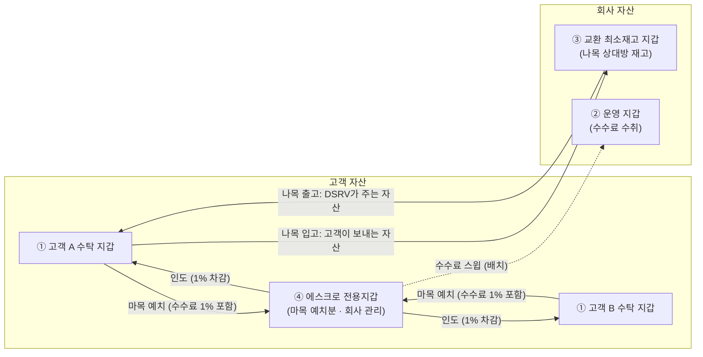
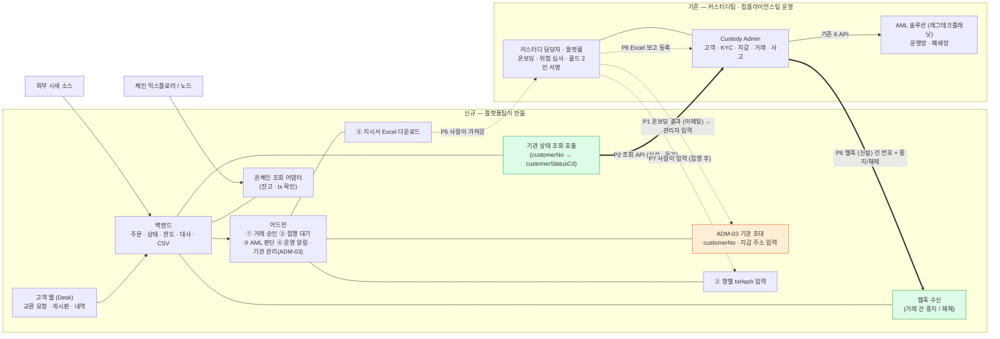
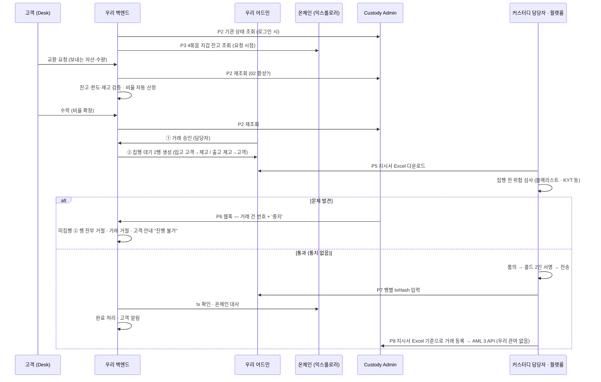
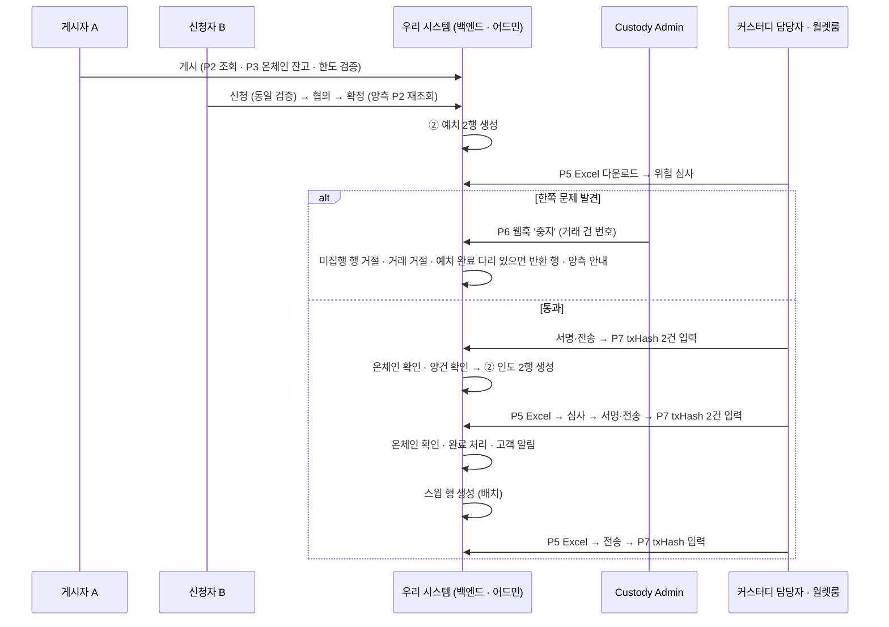
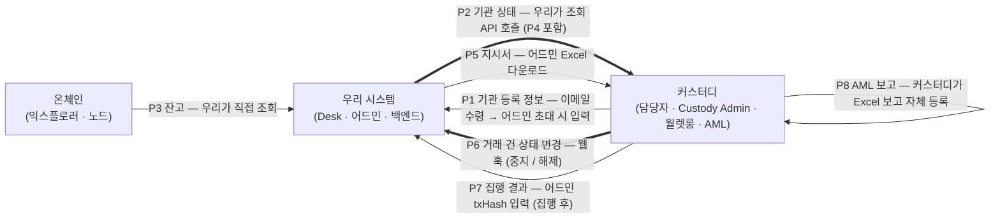
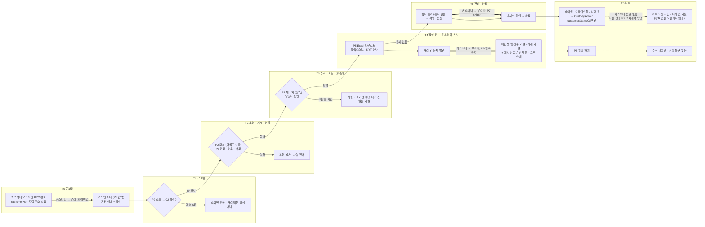
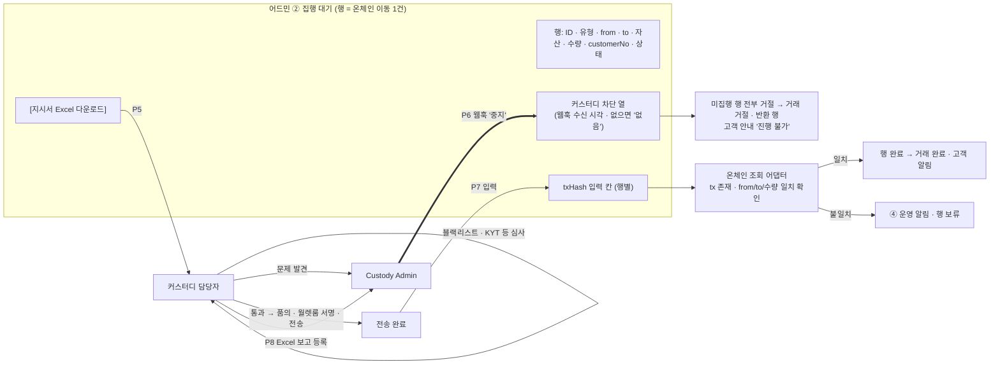
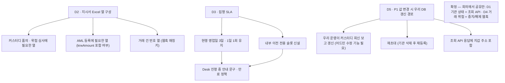

# 36. 교환·중개 시스템 ↔ 커스터디 연동 범위 — 플랫폼·커스터디·프론트엔드 회의 설명자료

작성 2026-09-07 · v5(커스터디 연동 방식 최종 — 기관 상태 **조회 API** · 거래 건 **상태 변경 웹훅** · 상태 코드 customerStatusCd 6종 · 적정/보완 판정 폐기) · 대상 = 서비스를 처음 접하는 플랫폼 개발팀 · 함께 읽는 사람 = 커스터디팀·프론트엔드
근거 = `knowledge/09_원천자료_목록.md` §0(확정 전제 · 2026-09-07(21)·(22)·(23)) · `drafts/37`(커스터디팀 연동 요청문) · `reference/custody/01_Custody_AML솔루션_연동API_20260701.md` · `reference/custody/Custody-M-01_…운영업무매뉴얼_v2` · 상세 분석 = `drafts/35`
Notion 게재본(다이어그램 포함): https://app.notion.com/p/3d47fc3011a981ce841fdee7ca4869ca
표기: **[사실]** 자료 확인 · **[추론]** 자료로부터 해석 · **[결정]** 오늘 정할 것 · **[확정]** 2026-09-07 기획 결정 · **[확인필요]** 커스터디팀 답변 필요

> 이 문서는 기획 산출물이다(근거 아님). 커스터디 현행은 2026-02~07월 자료 기준이므로 회의에서 현행 여부를 먼저 확인한다.
> **v2 변경**: 오가는 정보는 그대로 두고 **각각을 어떻게 주고받는지**를 확정. 시스템 간 API 후보 7개 → 최대 2개, 나머지는 **사람이 어드민 화면을 매개로** 처리.
> **v3 변경**: **거래 위험 판정**(현 P6) 추가 — 커스터디가 집행 전 블랙리스트·KYT 등 거래 위험 심사에서 문제를 확인하면 **우리 시스템에 전달**해야 우리가 해당 거래를 막고 고객에게 안내할 수 있다.
> **v4 변경**: ① **P1 기관 등록 정보** 추가 — 커스터디 오프라인 온보딩이 끝나면 **customerNo·수탁 지갑 주소**를 받아 어드민 초대 시 입력한다. ② 기관 식별자를 **customerNo로 일원화**. ③ **사고·차단 전달 항목 삭제**(기관 상태로 흡수). ④ KYC(기관 상태) 조회 시점 다이어그램(§3-4).
> **v5 변경**: v4에서 [결정]으로 열어둔 D1·D4를 확정(09 §0 (22)·(23)). ① **P2 기관 상태 = 커스터디 조회 API**(우리가 customerNo로 묻고 customerStatusCd를 받는다 · 관문마다 호출 · 변경 웹훅 없음). ② **상태 코드 = customerStatusCd 6종 그대로**(01 신규 / 02 활성 / 03 휴면 / 04 거래중지 / 05 거래해지 / 06 거래거절 — 02만 거래 가능). 종전 5종·ADM-03 [상태 변경 ▾]·어드민 수동 입력 폐기. ③ **P6 거래 위험 = 거래 건 상태 변경 웹훅**(커스터디 → 우리 · 건 번호 + 중지/해제) — 어드민 행별 적정/보완/부적정 입력·판정 전 txHash 차단 폐기. ④ 웹훅 실패 대비 = 커스터디 재시도 + 슬랙 통보(내부 정책). ⑤ P4(기관 단위 AML 결과값)는 별도 항목 없이 P2 조회값에 포함.

---

## 0. 세 줄 요약

1. **만드는 것** = 커스터디 법인 고객이 쓰는 웹 하나(교환 요청·중개 게시판) + 어드민 하나. 고객·지갑·키·서명·AML 심사·보고는 **만들지 않는다.** 전부 커스터디팀이 이미 운영하는 체계(Custody Admin·월렛룸·AML 솔루션)를 쓴다.
2. **오가는 정보** = 8종(§3-3) **전부 확정**. 사람이 어드민 화면으로 주고받는 것 3종 — 온보딩 결과 **customerNo·지갑 주소를 초대 시 입력**(P1) → 집행 지시서 **Excel 다운로드**(P5) → 서명·전송 후 **행별 txHash 입력**(P7). 우리가 직접 보는 것 1종 — 잔고는 **온체인 직접 조회**(P3). 시스템 연동 2종 — **기관 상태는 우리가 커스터디 조회 API로 묻고**(P2 · P4 포함), **거래 위험은 커스터디가 거래 건 중지/해제 웹훅으로 알린다**(P6). AML 보고 데이터는 **커스터디가 지시서 Excel을 보고 Custody Admin에 직접 등록**(P8, 우리 관여 없음).
3. 현재 자료 기준 우리 시스템과 Custody Admin 사이에 **존재하는 API는 없다** [사실]. 따라서 커스터디에 **조회 API 1개 + 웹훅 1개 신설**을 요청한다(`drafts/37` 요청문). 오늘 정할 것은 지시서 Excel 열(D2)·집행 SLA(D3)·P1 값 변경 갱신 경로(D5), 확인할 것은 §7.

---

## 1. 서비스가 무엇인지 (플랫폼팀용 1분 설명)

| 항목 | 내용 | 출처 |
|---|---|---|
| 고객 | **국내 법인**, 이미 DSRV 커스터디에 가입해 KYC(CDD)를 마친 회사. 신규 고객 유입 없음. 우리 시스템 등록은 **어드민 초대**(P1) | 09 §0 |
| 자산 | ETH · USDC · USDT (Ethereum 체인 단일) | 09 §0 |
| 서비스 ① 교환(나목) | 고객이 **DSRV와 직접** 교환. 예: 고객 USDT → DSRV, DSRV ETH → 고객. 비율은 외부 시세 + 고정 스프레드로 시스템이 자동 산정. 체결은 고객 수락 → DSRV 승인 → **커스터디 위험 심사·콜드월렛 수동 집행** | 09 §0 |
| 서비스 ② 중개(마목) | 고객 간 **게시판**. A가 "USDC 팔고 USDT 사겠다" 게시 → B 신청 → 협의 → 확정. 확정되면 양쪽이 **에스크로 전용지갑**에 예치 → 양건 확인 → 상대에게 인도 | 09 §0 |
| 한도 | 건당 1,500,000원 상당(요청 시점 KRW 환산) | 09 §0 2026-09-02(9) |
| 수수료 | 중개 1%(양 당사자 각자) · 교환은 스프레드에 포함 | 09 §0 |
| 시스템 | 고객 웹(Desk) + 어드민. 오더북·자동 매칭·자동 체결 **없음**. 핫월렛 **없음** | 09 §0 |
| 온체인 이동 | 전부 **DSRV가 관리하는 콜드 지갑 사이**의 이동. 외부 주소로 나가는 출금은 이 서비스에 없음 | 09 §0 2026-09-04(17) |

**자산이 놓이는 지갑 4묶음과 이동 경로** [사실 — 09 §0 2026-09-03(15)]

| # | 묶음 | 소유 | 용도 | 주소를 우리 시스템이 갖는 방법 |
|---|---|---|---|---|
| ① | 고객 수탁 지갑 | 고객 자산 | 현행 커스터디 지갑. **법인 1사 · 체인 1개당 1지갑**(Ethereum 단일이므로 지금은 법인당 1개, ETH·USDC·USDT 공용) **[확정]** | **기관 초대 시 입력**(P1) |
| ② | 운영 지갑 | 회사 | 수수료 수취(스윕 도착지) — **신규 생성** | 어드민 설정값 |
| ③ | 교환 최소재고 지갑 | 회사 | 나목 교환 상대방 재고 — **신규 생성** | 어드민 설정값 |
| ④ | 에스크로 전용지갑 | 고객 자산(회사 관리) | 마목 정산 예치 — **신규 생성** | 어드민 설정값 |

②③④ 생성은 커스터디팀 월렛룸 절차(작업신청 요청서 품의 → 월렛룸 → 신규지갑생성확인서)를 탄다 [사실 — 매뉴얼 2.3]. 모든 화살표는 DSRV 관리 지갑 사이의 이동이라 **외부 출금·화이트리스트가 개입하지 않는다.** 우리 시스템은 4묶음의 주소로 온체인 잔고를 직접 조회한다(§4-1 P3).

---

## 2. 시스템 구성 — 누가 무엇을 갖는가

| 데이터 | 소유 시스템 | 우리 시스템은 | 근거 |
|---|---|---|---|
| 고객 마스터(법인 정보·대표자·대리인·실소유자) | Custody Admin | **customerNo(= 우리 기관 ID) · 법인명 · 수탁 지갑 주소 · 가입자 이메일**만 보유. 개인정보 컬럼 없음. 내부 채번 ID 없음 **[확정]** | Notion 01 ②, 09 §0 (17), 2026-09-07 결정 |
| 기관 상태(KYC·재이행·요주의인물·사고 결과 — **기관 단위**) | Custody Admin(customerStatusCd) | **조회 API로 읽기만 한다**(P2 · P4 포함). 저장은 마지막 조회값 + 조회 시각. 사유 없음. 이 시스템에서 바꾸는 기능 없음. **초기값은 '활성'**(customerNo 발급 = 온보딩 완료) **[확정]** | 09 §0 (22)①② |
| 거래 위험 심사(**거래 단위** — 블랙리스트·KYT 등) | 커스터디·AML 부서 | **거래 건 중지/해제 통지만 수신** → P6. 심사 로직·사유·단계는 우리에 없음 | 09 §0 (22)③·(23) |
| 지갑 주소·키 | Custody Admin·월렛룸 | ① 고객 수탁 주소는 **초대 시 입력값**(P1), ②③④는 **설정값**. 키·서명 로직 없음 | 09 §0 |
| 온체인 잔고 | 온체인(체인 자체) | **우리가 익스플로러·노드에서 직접 조회** [확정] | 2026-09-07 결정 |
| 온체인 전송 실행 | 월렛룸(사람) | 지시서 Excel 발행 + txHash 수동 입력 수신 | 09 §0 승인·통제 |
| AML 거래 보고·STR | Custody Admin → AML 솔루션 · 컴플라이언스 | **관여 없음** — 커스터디가 지시서 Excel을 보고 등록 [확정] | Notion 01 ⑤ |
| 사고·차단(압류·동결·이용 제한) | Custody Admin | **별도 항목 없음.** 결과는 P2 조회값(6종 중 하나)으로 받는다 **[확정]** — 어느 코드로 오는지 [확인필요 Q12] | 09 §0 (21)⑧·(22)② |
| 주문·게시·협의·승인·집행 지시·대사·CSV | **우리** | 소유 | 09 §0 |

---

## 3. 거래 한 건이 흐르는 순서와 커스터디 접점

### 3-1. 교환(나목)

### 3-2. 중개(마목)

게시(BRK-02) → 신청·협의(BRK-03) → 확정 → **예치 2행**(A→에스크로, B→에스크로) → 양건 확인 → **인도 2행**(에스크로→B, 에스크로→A, 수수료 1% 차감) → 완료 → 수수료 **스윕**(에스크로→운영, 배치). 접점은 나목과 같고, Excel 다운로드 → 심사 → 서명 → txHash 입력 사이클이 **예치·인도·스윕 3번** 돈다. **중지 웹훅이 오면** 그 거래의 미집행 행을 전부 거절하고, 이미 예치가 끝난 다리(txHash 입력·대사 완료 기준)가 있으면 상대방 예치분을 **반환 행**으로 돌린다.

### 3-3. 오가는 정보 8종과 주고받는 방식 [전부 확정]

번호는 **한 기관이 겪는 순서**다. P1(등록) → P2·P3·P4(거래 전 검증에 쓰는 값) → P5·P6·P7(집행 한 사이클) → P8(사후 보고).

| # | 정보 | 방향 | 시점 | 주고받는 방식 | 상태 | 없으면 |
|---|---|---|---|---|---|---|
| **P1** | **기관 등록 정보** — customerNo · 수탁 지갑 주소(체인별 1개) · 법인명 | 커스터디 → 우리 | 커스터디 **오프라인 온보딩 완료 후**, 우리 시스템 초대 전 | 커스터디 담당자가 **이메일 등 오프라인으로 전달** → 관리자가 어드민 **ADM-03 초대 폼**에 기관명·가입자 이메일과 함께 입력 → 초대 발송. **이것이 우리 시스템의 고객 온보딩.** 기관 상태 초기값 **'활성'**. 값 변경(주소 교체·오기)은 **커스터디에 이메일로 요청 → 커스터디가 처리**(우리 쪽 별도 변경 워크플로 없음 · 우리 DB 갱신 경로는 D5) | **[확정]** | 지시서에 from/to 주소·customerNo를 채울 수 없고 잔고 조회 대상이 없음 |
| **P2** | **기관 상태** — customerStatusCd 6종(01 신규 / 02 활성 / 03 휴면 / 04 거래중지 / 05 거래해지 / 06 거래거절) | **우리 → 커스터디(조회)** | **우리가 관문마다 호출**: T1 로그인 · T2 요청/게시/신청 · T3 수락/확정/① [승인] 클릭 · ADM-03 진입/새로고침. 캐시·폴링 없음 | **Custody Admin 조회 API(신설 요청)** — 입력 customerNo · 출력 customerStatusCd. **02 활성만 거래 가능**, 그 외 5종은 전부 같은 처리(KYC 예외 배너 + 거래 버튼 비활성 · 조회 가능). 관문 조회에서 비활성이 확인되면 그 기관의 ①·② 대기 건 **일괄 거절**. **상태 변경 웹훅은 요청하지 않는다** — 변경은 다음 관문 조회에서 반영. 사유 없음. 압류·동결 등 사고도 이 6종 안의 값으로 받는다 | **[확정]** | 거래중지·해지 고객이 요청 가능해짐 · 차단 고객의 대기 건이 집행됨 |
| P3 | 자산별 잔고 | **온체인 → 우리** | 요청·게시·신청 시 + 어드민 새로고침 | 우리가 4묶음 지갑 주소(①은 P1 입력값)로 **익스플로러·노드에서 직접 조회**. ERC-20(USDC·USDT)은 `balanceOf` 조회 · 컨펌 기준은 정책값. 예치 중·집행 중 차감은 우리 장부 | **[확정]** 커스터디가 주지 않음 | 잔고 초과 요청 발생 |
| P4 | AML 결과값 — **기관 단위**(재이행·요주의인물·고위험) | — | — | **별도 항목 없음.** 결과는 커스터디가 customerStatusCd에 반영하고 우리는 P2 조회로 읽는다. 사유 코드는 받지 않는다 | **[확정]** P2에 포함 | — |
| P5 | 집행 지시서 | 우리 → 커스터디 | ① 승인 후 | 어드민 ② 집행 대기 **Excel 다운로드** | **[확정]** | 콜드 서명자가 무엇을 보낼지 모름 |
| **P6** | **거래 위험 — 거래 건 상태 변경**(블랙리스트·KYT 등 집행 전 심사) | 커스터디 → 우리 | **P5 이후 · 서명 전** — 해당 거래 건의 커스터디 측 상태가 바뀔 때(중지 / 해제 양방향) | **웹훅(신설 요청)** — 페이로드 = **거래 건 번호(EXC-/BRK-) + 상태값(중지 / 해제)**. 사유·단계 없음. **중지** → 그 거래의 미집행 ② 행 전부 거절 → 거래 거절 → 마목에서 예치 완료 다리가 있으면 상대방 예치분 반환 행 → 고객 안내 "진행 불가"(사유 미노출). **해제** → 수신 기록만, 거절 복구 없음(고객이 다시 요청). **심사 통과는 통지 없음** → 커스터디가 서명·집행 후 txHash 입력. 적정/보완 판정·판정 전 txHash 차단은 두지 않는다 | **[확정]** | **우리가 위험 거래를 막을 근거가 없고, 고객에게 "왜 진행되지 않는지" 안내 불가** |
| P7 | 집행 결과 | 커스터디 → 우리 | 전송 후 | 담당자가 어드민 **행별 txHash 입력 칸**에 입력. 우리는 온체인에서 tx 확인 후 완료 | **[확정]** | 완료 처리·대사 불가 |
| P8 | AML 보고용 거래 데이터 | (우리 → 커스터디) | 전송 후 | **별도 전달 없음.** 커스터디가 지시서 Excel과 자기 거래 내역으로 Custody Admin에 등록 | **[확정]** | Excel에 필요한 항목이 빠지면 커스터디가 재조회 |

> **P2와 P6의 차이**: P2는 "이 **기관**이 지금 거래 가능한가"(KYC·재이행·요주의인물·사고) — **우리가 묻는다**(조회 API, 관문마다). P6은 "이 **건**을 보내도 되는가"(블랙리스트·KYT 등) — **커스터디가 알린다**(웹훅, 건 단위·문제 시). 기관 상태는 커스터디가 push하지 않으므로 우리가 읽지 않으면 모른다. 거래 건은 우리가 물을 수 없으므로 커스터디가 보내야 한다.
> **웹훅 실패 대비** [확정 · 내부 정책]: 커스터디가 재시도(횟수·간격은 커스터디 정책) → 그래도 실패하면 슬랙으로 통보(내부 운영 정책서에만 기재 · 커스터디 요청 항목 아님) → 관리자가 ② 해당 행을 [이전 중지]로 수동 처리. 되묻는 조회 API는 두지 않는다. 미수신 행은 집행 대기에 남는다(보류 만료 없음).
> **삭제된 항목**: 종전 "사고·차단(압류·동결·이용 제한)" 전달(P2로 흡수) · 기관 상태 **어드민 수동 입력**·ADM-03 [상태 변경 ▾] · 종전 상태 5종(심사중·활성·일시제한·동결·해지) · **적정/보완/부적정 3분류**·판정 전 txHash 차단·보완 보류 · 기관 상태 **변경 웹훅** · 차단 **사유 코드**·단계 정보 · 되묻는 조회 API. 우리 시스템은 사고 유형·기간·심사 사유를 저장하지 않는다.

### 3-4. 기관 상태·거래 위험을 **언제 확인하고, 커스터디가 언제 우리에게 알려야 하는가**

원칙: **기관 상태는 우리가 거래 생애주기의 매 관문에서 커스터디에 조회한다**(단일 필드 · 캐시 없음 · 커스터디는 push하지 않음). **거래 건은 커스터디가 상태가 바뀔 때 웹훅으로 알린다**(중지 / 해제). 완료된 온체인 이동은 되돌리지 않는다.

| 시점 | 우리가 확인하는 것 | 커스터디가 우리에게 줘야 하는 것 | 없으면 |
|---|---|---|---|
| T0 온보딩 | — | **① P1** customerNo · 지갑 주소 · 법인명(이메일) | 초대 불가 |
| T1 로그인 | **P2 조회** → 02 활성 여부 | (조회 API 응답) | 비활성 기관이 요청 화면 진입 |
| T2 요청·게시·신청 | **P2 조회**(마목은 양측) · P3 잔고 · 한도 · 재고 | (조회 API 응답) | 잔고 초과·비활성 기관 요청 |
| T3 수락·확정·① 승인 | **P2 재조회**(양측) · 담당자 승인. 비활성 확인 시 그 기관 ①·② 대기 건 일괄 거절 | (조회 API 응답) | T2~T3 사이 비활성 전환 누락 |
| **T4 집행 전** | (커스터디 심사 결과 대기 · 우리 쪽 차단 없음) | **② P6 웹훅 '중지'**(거래 건 문제) — 기관 문제를 심사 중 발견했을 때 그 거래 건도 중지 통지하는지 [확인필요 Q10] | **우리는 위험 거래를 막을 수도, 고객에게 안내할 수도 없음** — 이 자료의 핵심 요청 |
| T5 전송 후 | P7 txHash → 온체인 일치 | **③ P7 txHash** | 완료 처리 불가 |
| T6 사후 | 다음 관문 P2 조회 · ADM-03 진입 시 조회 | (없음 — 상태 변경은 push하지 않음) · P6 '해제' 웹훅은 기록만 | 문제 기관의 다음 거래는 관문 조회로 잡힘. ① 승인 후 ② 대기 중 비활성 전환은 ADM-03 조회 또는 커스터디 심사에서 잡힘 [확인필요 Q10] |

---

## 4. 주고받는 방식별 상세

### 4-0. 기관 등록(P1) — 어드민 ADM-03 초대 폼 **[확정]**

현재 초대 폼(기관명·가입자 이메일)에 두 칸을 더한다. customerNo가 곧 우리 기관 ID다.

| 입력 칸 | 값 | 검증 | 출처·비고 |
|---|---|---|---|
| 기관명 | 커스터디 등록 법인명 그대로 | 2~50자 · 중복 불가 | 지시서 Excel 법인명 열과 커스터디 품의 서식이 어긋나지 않게 안내문 |
| 가입자 이메일 | 기관 담당자 1인 | 형식 · 중복 불가 | 기관당 가입자 1명(기존) |
| **customerNo** | 커스터디 발급 고객 식별번호 | 형식 `L-XXXXXX-XXXX` [사실 — AML API 문서 putCustomer] · 기관 간 중복 불가 | **내부 채번(ORG-NNNN) 폐기** — 화면·Excel·CSV·감사로그 식별자 전부 customerNo |
| **수탁 지갑 주소** | Ethereum 주소 1개(법인 1사 · 체인 1개당 1지갑) | `0x` + 40 hex · EIP-55 체크섬 · 다른 기관·②③④ 주소와 중복 불가 | 체인 추가 시 체인별 칸 추가 |

- 초대 발송 시 기관 상태 = **활성**(customerNo 발급 = 커스터디 CDD 완료). 종전 초기값 '심사중(EDD)'과 관련 [확인필요]는 이것으로 닫는다. 이후 상태는 커스터디 조회값(P2)으로만 표시하고 이 화면에서 바꾸지 않는다(종전 [상태 변경 ▾] 삭제).
- **변경**: 주소 교체·오기·법인명 변경은 우리 화면에 수정 기능을 두지 않는다. 고객 또는 우리 운영이 **커스터디에 이메일로 요청 → 커스터디가 처리**한다. 다만 커스터디 담당자 어드민 계정에도 기관 편집 권한을 두지 않으므로(권한 = Excel 다운로드·txHash 입력만) **우리 DB의 주소·법인명을 누가 어떻게 갱신하는지는 미정** → **D5**.
- 초대 후 가입자가 ONB-01~03에서 계정을 활성화하고 로그인하면 T1부터 §3-4 흐름을 탄다.

### 4-1. 사람이 어드민 ② 집행 대기 화면으로 처리하는 것 [확정 P5·P7·P3]

**행 상태 전이(안)**: 지시서 대기 → (Excel 다운로드) 집행 중 → (txHash 입력) 온체인 확인 중 → 완료 / 중지 웹훅 수신: 거절(+반환 행 생성) / 관리자 [이전 중지]: 거절 / 만료. 관문 조회에서 기관 비활성이 확인되면 그 기관의 모든 대기 행은 상태와 무관하게 거절. 판정 전 txHash 차단은 없다 — 커스터디가 심사 후 집행하고 입력한다.

| # | 화면 요소 | 내용 | 결정할 세부 |
|---|---|---|---|
| P5 | **[지시서 Excel 다운로드]** 버튼 | 선택 행(또는 배치 단위)을 Excel로 내림. 열: 행 ID · 유형(입고/출고/예치/인도/반환/스윕) · from 지갑 · to 지갑 · 자산 · 수량 · 요청 기관 **customerNo**·법인명 · **거래 건 번호(EXC-/BRK-)** — 웹훅이 이 번호로 온다 · 승인자 ID · 승인 시각 · 만료 시각 · **요청 시점 KRW 환산**(커스터디 AML 등록 krwAmount 참고용) | 커스터디 품의 서식·위험 심사에 필요한 열 [확인필요] · 다운로드 기록(누가·언제) 보존 |
| **P6** | **커스터디 차단 열**(행별) | 값 = 중지 웹훅 수신 시각(없으면 "없음") · 해제 수신 시각. 사람이 입력하는 칸이 아니다. **중지 수신** → 그 거래 건의 미집행 행 전부 거절 → 거래 거절 → 마목이면 예치 완료 다리의 상대방 예치분 반환 행 자동 생성 → 고객 안내(사유 없이 "진행 불가") · 이메일 ⑤. **해제 수신** → 이 열에 시각만 기록, 아무 것도 하지 않는다. 이미 거절된 건의 재통지도 기록만 | 고객 안내 문구(AML 심사 내용 미노출 원칙) · 웹훅 미수신 시 관리자 [이전 중지] 절차(내부 정책서) |
| P7 | **txHash 입력 칸**(행별) | 담당자가 전송 후 입력. 온체인 조회로 tx 존재·from/to/수량 일치 확인 → 일치 시 행 완료, 불일치 시 보류 + ④ 운영 알림 | 입력 권한(커스터디 담당자 어드민 계정) · 실 가스비·서명자 ID도 입력받는지 · 입력 마감 |
| P3 | **잔고 표시 + [새로고침]** | 어드민·Desk의 잔고 = 온체인 조회값 − 우리 장부의 예치 중·집행 중 수량. 거래 요청·게시·신청 시점에 재조회해 검증. ERC-20은 `balanceOf`, 컨펌 기준 정책값 | 익스플로러 API vs 자체 노드 · 조회 실패 시 입력 비활성 · 캐시 유효 시간 |
| P8 | (없음) | 우리 화면 없음. 커스터디가 Excel + Custody Admin 거래 내역으로 등록 | Excel의 KRW 환산 열을 쓸지, 커스터디 기준가액을 쓸지 [확인필요 — 컴플라이언스] |

### 4-2. 시스템 연동 2종 [확정 — 커스터디에 신설 요청 · `drafts/37`]

| # | 연동 | 방향 | 규격(요청) | 우리 쪽 처리 | 실패 시 |
|---|---|---|---|---|---|
| P2 | **기관 상태 조회 API** | 우리 → Custody Admin (동기) | 입력 customerNo → 출력 customerStatusCd(01 신규 / 02 활성 / 03 휴면 / 04 거래중지 / 05 거래해지 / 06 거래거절) | 관문마다 호출(T1·T2·T3 · ADM-03 진입/새로고침). 02만 통과. 마지막 조회값·조회 시각 저장(표시 전용). 비활성 확인 시 그 기관 ①·② 대기 건 일괄 거절 | 조회 실패 = 거래 버튼 비활성 + 공통 배너 · ADM-03 "조회 실패". 응답 지연 시 관문 처리 [확인필요 Q14] |
| P6 | **거래 건 상태 변경 웹훅** | Custody Admin → 우리 | 페이로드 = 거래 건 번호(EXC-/BRK-) + 상태값(중지 / 해제). 사유·단계 없음 | 중지 → 미집행 ② 행 거절 · 거래 거절 · 반환 행 · 고객 안내. 해제 → 기록만. 재통지 → 기록만 | 커스터디 재시도(정책은 커스터디) → 재시도 실패 시 슬랙 통보(내부 정책) → 관리자 ② 행 [이전 중지] |

**요청하지 않는 것**: 기관 상태 **변경 웹훅**(관문 조회로 대체) · 해제 통지에 따른 거래 **복구** · 차단 **사유 코드·단계** · **성공 집행 통지**(txHash 입력 + 온체인 대사로 닫힘) · 되묻는 **조회 API**(거래 위험) · 사고 유형·기간 · 잔고·AML 보고 데이터·KYT 심사 로직.
**P1은 초대 1회성**이라 API 대상이 아니다.

### 4-3. 우리가 호출하지 않는 것

| 기존 API(Custody Admin → AML 솔루션) | 이유 |
|---|---|
| putProduct · putCustomer · getKycresultUnapproved · /callback | 고객·상품·KYC는 Custody Admin 소유. 우리는 customerNo만 P1로 받고, 상태는 P2 조회 API로 읽는다 |
| putAccount | 지갑 ②③④ 등록도 지갑 생성 주체(커스터디)가 한다 |
| putSendReceipt · putTransaction · putAccount(잔고) | 폐쇄망 · 호출 주체 Custody Admin. **우리는 데이터도 만들지 않는다** [확정] |
| checkAccountTrouble | 사고 등록은 Custody Admin. 우리는 결과를 P2 조회값으로만 받는다 |
| (KYT·블랙리스트 솔루션) | 거래 위험 심사는 커스터디·AML 부서가 수행. **우리는 P6 중지/해제 웹훅만 받는다** |

---

## 5. 어디까지 하는가 — 책임 경계

### 5-1. 플랫폼(백엔드)이 만드는 것 / 만들지 않는 것

| 만든다 | 만들지 않는다 |
|---|---|
| 기관 계정(로그인·2FA)·권한 · **커스터디 담당자용 어드민 계정·권한**(Excel 다운로드·txHash 입력 — 두 가지만) | 고객 온보딩·KYC·재이행 |
| **ADM-03 초대 폼(기관명 · 이메일 · customerNo · 수탁 지갑 주소)** · 기관 식별자 = customerNo | 기관 정보 변경 워크플로(이메일 → 커스터디 처리 · D5) · 내부 채번 ID |
| **기관 상태 조회 API 호출**(관문마다 · 6종 코드 그대로 저장·표시 · 조회 시각) · 비활성 확인 시 대기 건 일괄 거절 | **기관 상태 변경 UI·사유 저장·상태 변경 웹훅 수신**(종전 [상태 변경 ▾] · 5종 상태 폐기) |
| **웹훅 수신 엔드포인트**(거래 건 중지/해제) · 중지 처리(미집행 행 거절 · 거래 거절 · 반환 행 · 고객 안내) · 해제·재통지 기록 | **블랙리스트·KYT 등 거래 위험 심사 로직** · AML 솔루션 호출 · 보고 데이터 생성 · STR · 적정/보완 판정 입력 · 되묻는 조회 API |
| 교환 요청·비율 산정·수락 / 게시·신청·협의·확정 상태 머신 | 지갑 생성·키 관리·서명 |
| 어드민 4섹션(① 거래 승인 ② 집행 대기 ③ AML 판단 ④ 운영 알림) | 온체인 전송 코드 |
| ② 집행 대기: **지시서 Excel 생성·다운로드 · 커스터디 차단 열 · [이전 중지] · 행별 txHash 입력·검증** | 화이트리스트 · 외부 출금 |
| **온체인 조회 어댑터**(4묶음 잔고 · tx 확인) | 트래블룰 연동 |
| 잔고·한도·재고·기준가 편차 검증 | 잔고확인서·이용자명부 발급 |
| 온체인 대사(장부 vs 온체인) · 3면 대사 입력 · CSV 6종 · 시세 소스 어댑터·스프레드·한도 설정(ADM-03) | 개인정보 저장 · 사고 유형·기간·심사 사유 저장 |
| 고객 안내(진행 불가 · 기관 상태 배너) · 슬랙 통보 후 수동 처리 절차(내부 정책서) | — |

### 5-2. 개발 원칙 7개

1. 고객 개인정보 컬럼을 두지 않는다. customerNo·법인명·지갑 주소·상태 조회값·가입자 이메일만.
2. **기관 식별자는 customerNo 하나다.** 내부 채번을 만들지 않고, 화면·Excel·CSV·감사로그가 같은 값을 쓴다.
3. 콜드 서명·온체인 전송은 우리 코드에 없다. **Excel을 내고 txHash를 받아** 온체인에서 확인한다.
4. AML 솔루션을 직접 호출하지 않고, 보고용 데이터도 만들지 않는다. 지시서 Excel이 커스터디의 심사·등록 근거가 되므로 **Excel 열을 커스터디와 합의**한다.
5. 잔고의 원천은 온체인이다. 커스터디 시스템에 묻지 않는다. 조회 실패 시 추측값을 쓰지 않고 입력을 막는다.
6. **기관 상태는 커스터디 조회값(customerStatusCd 6종)이고 우리는 쓰지 않는다.** 관문(로그인·요청·확정·승인·ADM-03 진입)마다 다시 조회하고 캐시·폴링을 두지 않는다. 02 활성만 통과, 나머지 5종은 의미 분기 없이 같은 처리. 사고·차단도 이 값으로 받는다.
7. **거래 위험 심사는 우리가 하지 않고 거래 건 중지/해제 웹훅만 받는다(P6).** 중지에 따른 행 거절·반환 행·고객 안내는 우리 책임, 해제는 기록만. 심사 사유·단계는 받지 않고 고객에게 노출하지 않는다.

### 5-3. 커스터디팀이 하는 것

| 항목 | 현행 절차 | 교환·중개에서 달라지는 점 |
|---|---|---|
| 고객 온보딩 | 계약 → 오프라인 KYC(CDD) → 수탁 지갑 생성 → 신규 지갑 생성 확인서 메일 [사실 — 매뉴얼 3-1] | + **customerNo·지갑 주소·법인명을 우리 운영에 전달**(P1). 변경 요청은 이메일로 받아 처리 |
| 지갑 ②③④ 생성 | 작업신청 요청서 품의 → 월렛룸 → 신규지갑생성확인서 | 1회원 1지갑 정책의 예외(회사 소유 지갑 3종) [결정] |
| 기관 상태 관리 | Custody Admin customerStatusCd · 사고 등록(내부) | + **조회 API 제공**(customerNo → customerStatusCd · 신설). 상태 변경을 우리에게 push하지 않는다 |
| 집행 전 위험 심사 | 출금 사전 검증 이상 내역을 AML 부서에 공유 → 검토 **적정 / 보완 / 부적정** [사실 — 매뉴얼 2.6] | 대상이 내부 이전 행. 내부 3분류는 그대로 쓰되 **우리에게는 해당 거래 건이 중지/해제로 바뀔 때만 웹훅**(신설) — 종전에는 커스터디 내부에서만 끝났음 |
| 집행 | 고객 신청서 → 품의 4종(영업일 3일) → 최종 승인 → 월렛룸 2인 서명 | 기점이 **우리 어드민에서 내린 지시서 Excel** [확정]. 리드타임 재정의 [결정 D3] |
| 집행 결과 기록 | Custody Admin 거래 내역 반영 | + **우리 어드민에 txHash 입력** [확정] — 누가·언제 [확인필요 Q4] |
| AML 보고 | Custody Admin 자산 구분 승인 → AML 3 API | 내부 이전도 같은 절차. 근거 자료 = 지시서 Excel |
| 웹훅 운영 | — | 전송 실패 시 재시도(정책은 커스터디) · 재시도 실패 시 슬랙 통보(우리 내부 정책서 기재) |

### 5-4. 프론트엔드가 알아야 할 의존 지점

| 화면 | 의존 데이터 | 화면 동작 |
|---|---|---|
| 어드민 ADM-03 기관 초대·목록 | P1 · P2 | 초대 폼 4칸(기관명 · 이메일 · **customerNo** · **수탁 지갑 주소**) + 형식·중복 검증 · 목록 식별자 = customerNo · 초기 상태 '활성' · 수정 버튼 없음(변경은 커스터디 이메일 요청 안내) · **KYC 상태 칩 = 커스터디 조회값 6종 + 조회 시각(표시 전용 · 화면 진입·새로고침 시 조회 · 실패 시 "조회 실패")** · [상태 변경 ▾] 없음 |
| 로그인 후 전체 | P2 조회값 = 02 활성 | 그 외 5종이면 모든 거래 버튼 비활성 + KYC 예외 배너(조회 가능). 관문마다 재조회 · 조회 실패도 버튼 비활성 |
| 대시보드(DASH-01) · 교환 요청(EXC-01) · 게시(BRK-02) · 신청(BRK-03) | P2 · P3 온체인 잔고 − 예치 중·집행 중 | 요청·게시·신청 시점 재조회. 조회 실패 시 입력 비활성(추측값 표시 금지) · 조회 시각 표기 |
| 진행 중(EXC-03) · 예치·인도 진행 | P6 웹훅 · P7 txHash · P2 | '집행 대기' → 중지 웹훅 시 **'진행 불가'** + 반환 안내(사유 미노출) → txHash 후 '완료'. 관문 조회로 기관 비활성 확인 시 '진행 불가(기관 상태)'. '확인 중' 상태 없음 |
| 어드민 ② 집행 대기 | P5·P6·P7 | **[지시서 Excel 다운로드]** · **커스터디 차단 열**(웹훅 수신 시각) · **행별 txHash 입력 칸** + 검증 결과 · [이전 중지] · 다운로드·입력 이력 |
| 어드민 ③ AML 판단 | 우리 자체 이상거래 룰 | 커스터디 판정 목록 없음(중지 건은 ② 행 거절로 표시). 자동 승인·거절 없음 |
| 어드민 ④ 운영 알림 | 기관 비활성 확인 · P6 중지 수신 · 웹훅 미수신 슬랙 · txHash 불일치 | 기관 비활성으로 대기 건 일괄 거절됨 · 중지 웹훅 수신 · txHash 검증 불일치 |

고객 화면에 **시세 소스명·AML 심사 내용·내부 계정명은 노출하지 않는다.** [사실 — 09 §0 2026-09-02] → P6 고객 안내는 "이슈로 진행 불가" 수준에서 멈춘다.

---

## 6. 오늘 정할 것

| # | 결정 | 기획 제안 [추론] | 영향 |
|---|---|---|---|
| D2 | 지시서 Excel 열 | §4-1 P5 열 + 커스터디 요청 열. 거래 건 번호 열은 필수(웹훅 매칭) | Excel 생성 규칙 |
| D3 | 집행 SLA | 커스터디 답변(Q5) 후 | Desk 안내 문구 · 만료 정책 · 정산 배치 주기 |
| **D5** | **P1 값(지갑 주소·법인명) 변경 시 우리 DB 갱신** | (a) 커스터디가 이메일로 회신 → 우리 운영이 ADM-03에서 갱신(수정 기능 최소 1개 필요) — 변경 빈도가 낮아 제안 | ADM-03 수정 UI 유무 · 감사로그 |

**이미 정한 것(2026-09-07 확정, 회의에서 공유만)**: P1 초대 폼 입력·customerNo 일원화·지갑 법인당 체인별 1개·기관 상태 초기값 활성·변경은 커스터디 이메일 요청 · **P2 기관 상태 = 커스터디 조회 API(관문마다 · customerStatusCd 6종 · 변경 웹훅 없음)** · P3 온체인 직접 조회 · P5 Excel · **P6 거래 건 상태 변경 웹훅(중지/해제 · 건 번호 + 상태값)** · P7 txHash · P8 미제공 · 사고·차단 항목 삭제 · 적정/보완 판정·판정 전 txHash 차단 폐기 · 웹훅 실패 = 재시도 → 슬랙 → 수동 [이전 중지].
**결정을 기다리지 않고 시작할 수 있는 것**: 기관 계정 · ADM-03 초대 폼 4칸·상태 칩(조회값) · 화면 · 주문/게시/신청 상태 머신 · 어드민 4섹션 · **② 집행 대기 Excel 다운로드·커스터디 차단 열·txHash 입력 칸과 행 상태 머신** · **온체인 조회 어댑터** · **조회 API 호출 지점 + 웹훅 수신 엔드포인트**(규격은 `drafts/37`) · 시세 어댑터 · 한도 판정 · CSV.
**결정 후 착수**: Excel 열 확정 · 지갑 ②③④ 주소 설정 · 진행 불가 안내 문구 · D5 갱신 경로.

---

## 7. 커스터디팀에 오늘 확인할 질문

| # | 질문 | 관련 |
|---|---|---|
| Q1 | Custody Admin에 외부 시스템용 API가 있나. 없다면 **기관 상태 조회 API 1개 + 거래 건 상태 변경 웹훅 1개** 신설 가능한 팀·일정은 | P2 · P6 · `drafts/37` |
| Q2 | Custody Admin은 폐쇄망 안에 있나. 외부 API·웹훅을 어떤 경로로 열 수 있나. 우리 어드민에 커스터디 담당자가 접속(Excel 다운로드·txHash 입력)하는 데 망 제약이 있나 | P2·P5·P6·P7 · ISMS |
| Q3 | 지시서 Excel에 어떤 열이 있어야 현행 품의(작업신청 요청서·작업계획서·가스비 요청)·위험 심사·AML 등록을 재입력 없이 할 수 있나 | D2 |
| Q4 | txHash 입력을 누가 언제 하나(월렛룸 직후? 작업완료보고 후?). 실 가스비·서명자 ID도 입력 가능한가 | P7 |
| Q5 | 1일 1회·영업일 3일 정책의 근거와 완화 가능성. 내부 이전 전용 슬롯을 둘 수 있나 | D3 |
| Q6 | 회사 소유 지갑 ②③④를 1회원 1지갑 정책 예외로 생성 가능한가. AML 솔루션에 계좌 등록하나 | 지갑 4묶음 |
| Q7 | 커스터디 출금 한도(지갑·자산별)를 내부 이전에도 적용하나 | 한도 판정 |
| Q8 | 온보딩 완료 후 customerNo·수탁 지갑 주소·법인명을 우리 운영에 어떤 형식·시점으로 전달하나(신규 지갑 생성 확인서 메일에 포함?). 변경 요청(주소 교체·오기)을 이메일로 받았을 때 처리 결과를 우리에게 어떻게 회신하나 | P1 · §4-0 · D5 |
| Q9 | 내부 이전(입고·출고·예치·인도·반환·스윕)을 Custody Admin에 어떤 거래유형으로 등록할 계획인가(01 입금/02 출금만 존재) | P8 |
| **Q10** | **집행 전 위험 심사(블랙리스트·KYT 등)는 현행 출금과 같은 절차로 하나. 소요 시간은. 중지/해제 웹훅은 심사의 어느 단계에서 나가나. 심사 중 기관 문제(재이행 미응답·요주의인물 등)를 발견하면 customerStatusCd만 바꾸나, 그 거래 건도 중지 통지하나** — 후자가 아니면 ① 승인 후 ② 대기 중인 건은 우리 관문 조회가 없어 커스터디 집행 판단에만 의존한다 | P6 · §3-4 T4·T6 |
| Q11 | 운영매뉴얼 공유용에서 제외된 3장·별첨과 Custody-M-07 위기 대응 매뉴얼 공유 가능 여부 | 정산 배치 |
| Q12 | 압류·동결 등 **지갑 단위 사고 등록**이 customerStatusCd에 어떻게 반영되나(04 거래중지로 오나, 별도 값인가) | P2 · 사고·차단 흡수 |
| Q13 | 05 거래해지·06 거래거절 기관의 로그인을 허용해도 되나(현재 안 = 조회만 허용) | P2 게이팅 |
| Q14 | 조회 API 응답 지연·장애 시 우리 관문 처리(현재 안 = 거래 버튼 비활성 + 배너). SLA·타임아웃 기준을 둘 수 있나 | P2 |
| Q15 | 웹훅 상태값 "중지"는 기관 코드 04 "거래중지"와 이름이 같다 — 표기를 "건 중지 / 건 해제"로 구분해도 되나 | P6 표기 |

---

## 8. 이 문서와 다른 문서의 관계

- 커스터디팀에 보내는 요청 문안(조회 API·웹훅·웹훅 실패 대비) → `drafts/37`
- 접점별 상세·상충 14건·부서별 요청 자료 → `drafts/35` (접점별 수신 방식은 이 문서 v5가 우선. §6-6 "내부 이전에 KYT 대상 없음"은 **커스터디가 거래 단위 심사를 수행해 중지/해제를 통지한다**는 전제로 정정 대상)
- 확정 전제 정본 → `knowledge/09` §0 2026-09-07(21)·(22)·(23) 블록
- 기획서 → `drafts/33` v2.2(§E·F·H·N·§4·KYC·WAL·POL·CMP 재기술)
- 어드민 화면 → `drafts/storyboard` ADM-03(초대 폼 4칸·customerNo·초기 활성·상태 칩 조회값) · ADM-02(② 집행 대기 Excel·커스터디 차단 열·txHash) · states(AC-06~09·§4 규칙) · `drafts/34`는 폐기본
- AML API 원문 → `reference/custody/01`
