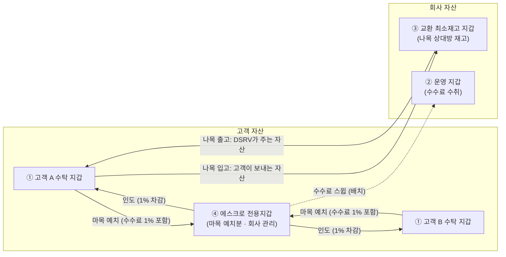
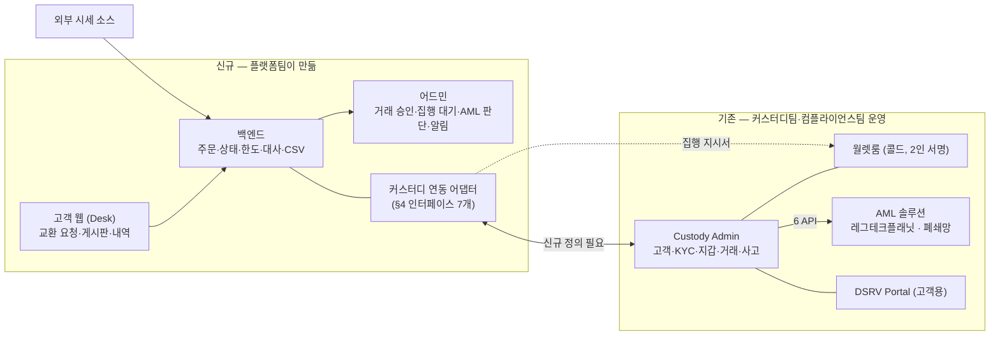
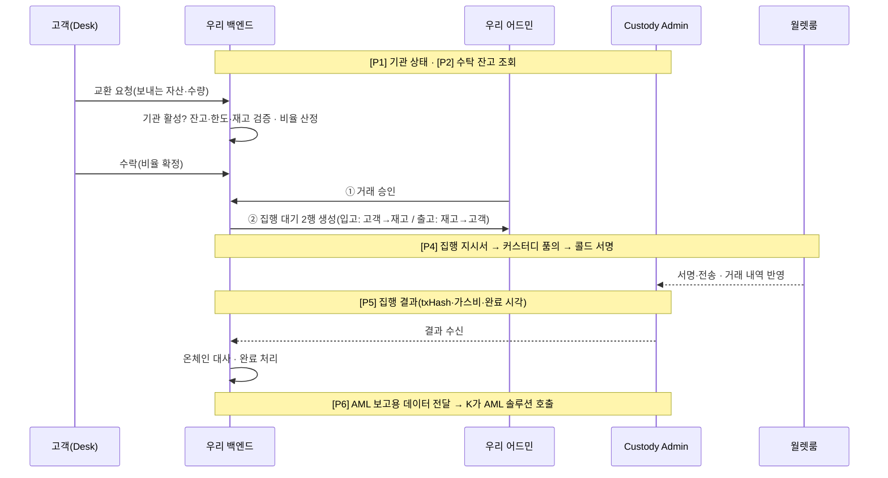
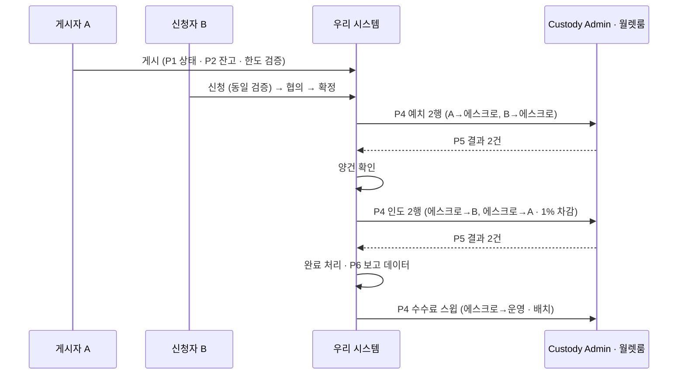
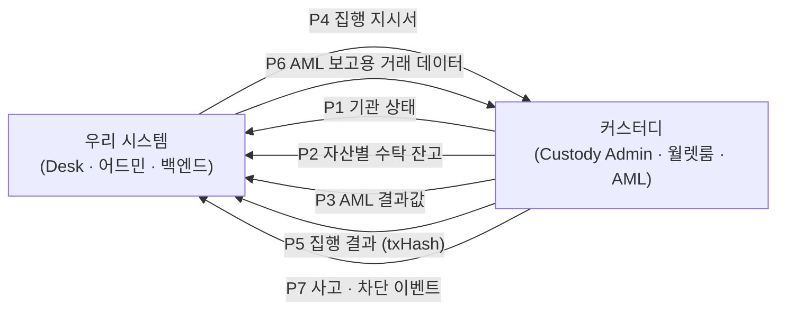
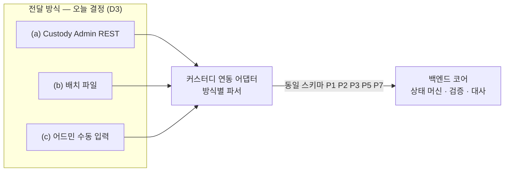
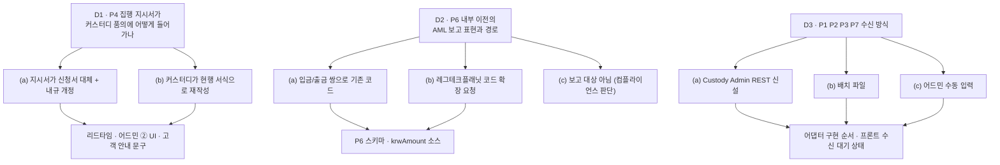

# 36. 교환·중개 시스템 ↔ 커스터디 연동 범위 — 플랫폼·커스터디·프론트엔드 회의 설명자료

작성 2026-09-07 · 대상 = 서비스를 처음 접하는 플랫폼 개발팀 · 함께 읽는 사람 = 커스터디팀·프론트엔드
근거 = `knowledge/09_원천자료_목록.md` §0(확정 전제) · `reference/custody/01_Custody_AML솔루션_연동API_20260701.md` · `reference/custody/Custody-M-01_…운영업무매뉴얼_v2` · 상세 분석 = `drafts/35`
Notion 게재본(다이어그램 포함): https://app.notion.com/p/3d47fc3011a981ce841fdee7ca4869ca
표기: **[사실]** 자료 확인 · **[추론]** 자료로부터 해석 · **[결정]** 오늘 정할 것 · **[확인필요]** 커스터디팀 답변 필요

> 이 문서는 기획 산출물이다(근거 아님). 커스터디 현행은 2026-02~07월 자료 기준이므로 회의에서 현행 여부를 먼저 확인한다.

---

## 0. 세 줄 요약

1. **만드는 것** = 커스터디 법인 고객이 쓰는 웹 하나(교환 요청·중개 게시판) + 어드민 하나. 고객·지갑·키·서명·AML 보고는 **만들지 않는다.** 전부 커스터디팀이 이미 운영하는 체계(Custody Admin·월렛룸·AML 솔루션)를 쓴다.
2. **연결 지점** = 7개(§3). 방향은 "커스터디 → 우리" 5종 데이터 수신, "우리 → 커스터디" 2종 전달.
3. **오늘 자료 기준으로, 우리 시스템과 Custody Admin 사이에 존재하는 API는 없다.** [사실] 있는 것은 Custody Admin ↔ AML 솔루션(레그테크플래닛) 6개 API뿐이고, 우리는 그것을 **직접 호출하지 않는다.** 따라서 "어떤 API로 연결하나"의 답은 §4의 **신규 인터페이스 7개를 오늘 정의하는 것**이다.

---

## 1. 서비스가 무엇인지 (플랫폼팀용 1분 설명)

| 항목 | 내용 | 출처 |
|---|---|---|
| 고객 | **국내 법인**, 이미 DSRV 커스터디에 가입해 KYC(CDD)를 마친 회사. 신규 고객 유입 없음 | 09 §0 |
| 자산 | ETH · USDC · USDT (Ethereum 체인 단일) | 09 §0 |
| 서비스 ① 교환(나목) | 고객이 **DSRV와 직접** 교환. 예: 고객 USDT → DSRV, DSRV ETH → 고객. 비율은 외부 시세 + 고정 스프레드로 시스템이 자동 산정. 체결은 고객 수락 → DSRV 승인 → **커스터디 콜드월렛 수동 집행** | 09 §0 |
| 서비스 ② 중개(마목) | 고객 간 **게시판**. A가 "USDC 팔고 USDT 사겠다" 게시 → B 신청 → 협의 → 확정. 확정되면 양쪽이 **에스크로 전용지갑**에 예치 → 양건 확인 → 상대에게 인도 | 09 §0 |
| 한도 | 건당 1,500,000원 상당(요청 시점 KRW 환산) | 09 §0 2026-09-02(9) |
| 수수료 | 중개 1%(양 당사자 각자) · 교환은 스프레드에 포함 | 09 §0 |
| 시스템 | 고객 웹(Desk) + 어드민. 오더북·자동 매칭·자동 체결 **없음**. 핫월렛 **없음** | 09 §0 |
| 온체인 이동 | 전부 **DSRV가 관리하는 콜드 지갑 사이**의 이동. 외부 주소로 나가는 출금은 이 서비스에 없음 | 09 §0 2026-09-04(17) |

**자산이 놓이는 지갑 4묶음과 이동 경로** [사실 — 09 §0 2026-09-03(15)]

| # | 묶음 | 소유 | 용도 |
|---|---|---|---|
| ① | 고객 수탁 지갑 | 고객 자산 | 현행 커스터디 지갑. 고객 1사·자산 1종당 1지갑 |
| ② | 운영 지갑 | 회사 | 수수료 수취(스윕 도착지) |
| ③ | 교환 최소재고 지갑 | 회사 | 나목 교환 상대방 재고 |
| ④ | 에스크로 전용지갑 | 고객 자산(회사 관리) | 마목 정산 예치 |

②③④는 **신규 생성이 필요**하고, 생성은 커스터디팀 월렛룸 절차를 탄다. [사실 — 매뉴얼 2.3]

---

## 2. 시스템 구성 — 누가 무엇을 갖는가

| 데이터 | 소유 시스템 | 우리 시스템은 | 근거 |
|---|---|---|---|
| 고객 마스터(법인 정보·대표자·대리인·실소유자) | Custody Admin | **식별자(customerNo)·법인명·상태만** 보유. 개인정보 컬럼 없음 | Notion 01 ②, 09 §0 (17) |
| KYC·재이행·요주의인물 결과 | AML 솔루션 → Custody Admin | 결과값(활성/비활성·고위험 여부)만 수신 | Notion 01 ②③ |
| 지갑 주소·키 | Custody Admin·월렛룸 | 주소를 **설정값**으로 보유. 키·서명 로직 없음 | 09 §0 |
| 온체인 잔고 | Custody Admin(온체인 반영) | 조회·수신만 | 매뉴얼 2.5·2.6 |
| 온체인 전송 실행 | 월렛룸(사람) | 지시서 발행 + 결과(txHash) 수신 | 09 §0 승인·통제 |
| AML 거래 보고·STR | Custody Admin → AML 솔루션 · 컴플라이언스 | 보고용 데이터 **생성해 전달** | Notion 01 ⑤ |
| 주문·게시·협의·승인·집행 지시·대사·CSV | **우리** | 소유 | 09 §0 |

---

## 3. 거래 한 건이 흐르는 순서와 커스터디 접점

### 3-1. 교환(나목)

### 3-2. 중개(마목)

게시(BRK-02) → 신청·협의(BRK-03) → 확정 → **예치 2행**(A→에스크로, B→에스크로) → 양건 확인 → **인도 2행**(에스크로→B, 에스크로→A, 수수료 1% 차감) → 완료 → 수수료 **스윕**(에스크로→운영, 배치). 커스터디 접점은 나목과 같은 P1·P2·P4·P5·P6이고, 온체인 행이 2개에서 4~5개로 늘어난다.

### 3-3. 접점 7개 요약

| # | 접점 | 방향 | 언제 | 없으면 |
|---|---|---|---|---|
| P1 | 기관 상태 | 커스터디 → 우리 | 로그인·모든 버튼 활성 조건·상태 변경 시 | 거래중지·동결 고객이 요청 가능해짐 |
| P2 | 자산별 수탁 잔고 | 커스터디 → 우리 | 요청·게시·신청 시 검증, 대시보드 표시 | 잔고 초과 요청 발생 |
| P3 | AML 결과값 | 커스터디(AML) → 우리 | KYC 재이행 진행 중·요주의인물 적중·고위험 | 어드민 ③ AML 판단 섹션이 비어 있음 |
| P4 | 집행 지시서 | 우리 → 커스터디 | ① 승인 후 ② 집행 대기 행 발생 시 | 콜드 서명자가 무엇을 보낼지 모름 |
| P5 | 집행 결과 | 커스터디 → 우리 | 콜드 서명·전송 완료 시 | 완료 처리·대사 불가 |
| P6 | AML 보고용 거래 데이터 | 우리 → 커스터디 | P5 완료 후 | AML 솔루션에 거래 미보고 |
| P7 | 사고·차단 이벤트 | 커스터디 → 우리 | 압류·동결 등록, 이용 제한 | 차단 고객의 대기 건이 집행됨 |

---

## 4. 인터페이스 7개 — "어떤 API로" 연결하는가

### 4-1. 전제 [사실]

- 현재 문서화된 API는 **Custody Admin → AML 솔루션 6개**(putProduct · putCustomer · getKycresultUnapproved · putAccount · putSendReceipt · putTransaction · checkAccountTrouble, 콜백 1개)다. Notion 01.
- 이 API의 호출 주체는 Custody Admin이고 AML 솔루션은 **운영망(폐쇄망) 내부**다. 우리 시스템이 폐쇄망 안에 들어가는지는 [확인필요 — ISMS].
- Custody Admin이 **외부 시스템에 제공하는 API가 있는지는 자료에 없다.** [확인필요 — 커스터디팀 C1]

→ 아래 7개는 **전부 신규 정의**다. 전달 방식(REST / 배치 파일 / 어드민 수동 업로드)은 오늘 결정하되, 백엔드는 **어느 방식이든 같은 스키마로 받는 어댑터**로 만든다.

### 4-2. 커스터디 → 우리 (수신 5종)

필드명은 기존 AML API 코드값을 그대로 재사용해 커스터디팀 쪽 변환을 없애는 방향. [추론]

| # | 인터페이스 | 필수 필드(안) | 기존 코드 재사용 | 갱신 시점 | 방식 [결정] |
|---|---|---|---|---|---|
| P1 | 기관 상태 | customerNo · customerName · customerStatusCd · 변경 시각 | customerStatusCd 01 신규/02 활성/03 휴면/04 거래중지/05 거래해지/06 거래거절 (putCustomer) | 상태 변경 즉시 + 일 1회 전체 동기 | 이벤트 푸시 vs 폴링 |
| P2 | 수탁 잔고 | customerNo · accountNo · network · currency · accountBalance · 기준 시각 · (예치 중·집행 중 수량) | putAccount 필드 | 집행 완료 시 + 조회 시 | 조회 API vs 스냅샷 |
| P3 | AML 결과값 | customerNo · kycResultCd · kycReasonCd(02 재이행 진행 중 여부) · 요주의인물 적중 Y/N · 고위험 Y/N · 판정 시각 | kycResult 01/02 ACTIVE·03 REJECTED, kycReasonCd 01/02/03 | 콜백 수신 시 · WLF 매월 | Custody Admin 콜백 중계 |
| P5 | 집행 결과 | 지시 행 ID · txHash · 실 가스비 · 완료 시각 · 서명자 ID(2인) · 결과 코드 | putTransaction의 txHash·tokenAmount·network | 콜드 전송 완료 즉시 | 월렛룸 작업 후 입력 경로 [확인필요] |
| P7 | 사고·차단 | customerNo · accountNo · 유형(압류/동결/이용 제한) · startDate · endDate | checkAccountTrouble 필드 | 등록·해제 즉시 | 이벤트 |

P4·P6이 없고 P5·P7이 있는 이유: 수신은 5종, 발신은 2종으로 방향을 나눈 것. 3면 대사용 **콜드 기록**은 P5에 포함되는지 별도 파일인지 [확인필요 — C8].

### 4-3. 우리 → 커스터디 (발신 2종)

| # | 인터페이스 | 내용 | 현행 대응물 | [결정] |
|---|---|---|---|---|
| P4 | 집행 지시서 | 행 ID · 유형(입고/출고/예치/인도/반환/스윕) · from 지갑 · to 지갑 · 자산 · 수량 · 요청 기관 customerNo · 승인자 ID · 승인 시각 · 만료 시각 · 명세 Excel | 현행은 **고객 서면 신청서**(입금·출금 신청서) → 품의 4종 → 월렛룸. 내부 이전에는 대응 서식 없음 [사실 — 매뉴얼 2.5·2.6] | 지시서가 신청서를 **대체**하는지, 커스터디 품의 서식에 어떻게 매핑하는지, 전달 경로(어드민 화면·파일·API) |
| P6 | AML 보고용 거래 데이터 | seq · date/time · customerNo · accountNo · 유형 · currency · tokenAmount · **krwAmount** · txHash · 상대 지갑 주소 · 상대 명칭 | putTransaction 필드 그대로. 단 거래유형이 **01 입금 / 02 출금** 두 개뿐 [사실] | 내부 이전 6종을 입금/출금 **쌍**으로 표현할지, 레그테크플래닛에 코드 확장을 요청할지 · krwAmount의 시세 소스 |

### 4-4. 우리가 호출하지 **않는** 것

| API | 이유 |
|---|---|
| putProduct · putCustomer · getKycresultUnapproved · /callback | 고객·상품·KYC는 Custody Admin 소유. 교환·중개를 AML 솔루션 '상품'으로 등록하는 일도 Custody Admin에서 한다 [결정 — 등록 여부] |
| putAccount | 지갑 ②③④ 등록도 지갑 생성 주체(커스터디)가 한다 |
| putSendReceipt · putTransaction · putAccount(잔고) | 폐쇄망 · 호출 주체 Custody Admin. 우리는 P6 데이터만 만든다 |
| checkAccountTrouble | 사고 등록은 Custody Admin. 우리는 P7로 결과만 받는다 |

---

## 5. 어디까지 하는가 — 책임 경계

### 5-1. 플랫폼(백엔드)이 만드는 것 / 만들지 않는 것

| 만든다 | 만들지 않는다 |
|---|---|
| 기관 계정(로그인·2FA)·권한 | 고객 온보딩·KYC·재이행 |
| 교환 요청·비율 산정·수락 / 게시·신청·협의·확정 상태 머신 | 지갑 생성·키 관리·서명 |
| 어드민 4섹션(① 거래 승인 ② 집행 대기 ③ AML 판단 ④ 운영 알림) | 온체인 전송 코드 |
| 집행 지시 행·명세 Excel 생성 (P4) | 화이트리스트 · 외부 출금 |
| 잔고·한도·재고·기준가 편차 검증 | AML 솔루션 호출 · STR |
| 온체인 대사(장부 vs 온체인) · 3면 대사 입력 | 트래블룰 연동 |
| CSV 6종(거래·구분회계·열람 기록 등) | 잔고확인서·이용자명부 발급 |
| 시세 소스 어댑터·스프레드·한도 설정(ADM-03) | 개인정보 저장 |
| 커스터디 연동 어댑터(P1~P7, 방식 무관 동일 스키마) | — |

### 5-2. 개발 원칙 5개 (35 §3-2 요약)

1. 고객 개인정보 컬럼을 두지 않는다. customerNo·법인명·상태만.
2. 콜드 서명·온체인 전송은 우리 코드에 없다. 지시서를 내고 결과를 받아 대사한다.
3. AML 솔루션을 직접 호출하지 않는다. P6 데이터를 만들어 넘긴다.
4. 수신 5종은 스키마를 먼저 고정하고, 전달 방식은 어댑터 뒤에 숨긴다.
5. KRW 환산 소스를 한도 판정과 AML 보고(krwAmount)에서 통일한다.

### 5-3. 커스터디팀이 하는 것

| 항목 | 현행 절차 | 교환·중개에서 달라지는 점 [결정] |
|---|---|---|
| 지갑 ②③④ 생성 | 작업신청 요청서 품의 → 월렛룸 → 신규지갑생성확인서 | 1회원 1지갑 정책의 예외(회사 소유 지갑 3종) |
| 집행 | 고객 신청서 → 품의 4종(영업일 3일) → AML 검토 → 최종 승인 → 월렛룸 2인 서명 | 기점이 **우리 지시서**로 바뀜. 리드타임(현행 영업일 3일·1일 1회 vs 우리 정산 배치 1영업일 3회) 재정의 |
| 거래 내역 반영 | Custody Admin에서 자산 구분 승인 → AML 3 API 호출 | 내부 이전도 같은 절차를 타는지 · 유형 표현 |
| 상태·잔고·사고 제공 | Admin 내부 | P1·P2·P3·P7을 외부(우리)에 제공 — **신규** |

### 5-4. 프론트엔드가 알아야 할 커스터디 의존 지점

| 화면 | 커스터디 데이터 | 없을 때 화면 동작 |
|---|---|---|
| 로그인 후 전체 | P1 기관 상태 = 활성 | 비활성이면 모든 거래 버튼 비활성 + 안내 |
| 대시보드(DASH-01) · 요청(EXC-01) · 게시(BRK-02) · 신청(BRK-03) | P2 자산별 잔고·처분 가능분 | 잔고 미수신 시 입력 비활성(추측값 표시 금지) |
| 진행 중(EXC-03) · 예치·인도 진행 | P5 집행 결과 | 결과 전까지 '집행 대기' 고정. 예상 소요 문구는 커스터디 SLA 결정 후 확정 |
| 어드민 ② 집행 대기 | P4 지시서 발행 · P5 결과 입력 | 지시서 다운로드/전송 버튼 · 결과 수동 입력 폼(방식 미결 대비) |
| 어드민 ③ AML 판단 | P3 결과값 | 값 없으면 '수신 대기' 표시, 자동 승인·거절 없음 |
| 어드민 ④ 운영 알림 | P7 사고·차단 | 수신 시 해당 기관 대기 건 일괄 거절 + 반환 행 |

고객 화면에 **시세 소스명·AML 심사 내용·내부 계정명은 노출하지 않는다.** [사실 — 09 §0 2026-09-02]

---

## 6. 오늘 정할 것 (결정 3묶음)

| # | 결정 | 선택지 | 영향 |
|---|---|---|---|
| D1 | **P4 집행 지시서**가 커스터디 품의에 어떻게 들어가나 | (a) 지시서가 신청서 대체 + 내규 개정 (b) 지시서 → 커스터디가 현행 서식으로 재작성 | 리드타임 · 어드민 ② 집행 대기 UI · 고객 안내 문구 |
| D2 | **P6 내부 이전의 AML 보고** 표현과 경로 | (a) 입금/출금 쌍으로 기존 코드 사용 (b) 레그테크플래닛 코드 확장 요청 (c) 보고 대상 아님(컴플라이언스 판단) | P6 스키마 · krwAmount 소스 |
| D3 | **P1·P2·P3·P7 수신 방식** | (a) Custody Admin REST 신설 (b) 배치 파일 (c) 어드민 수동 입력 | 어댑터 구현 순서 · 프론트 '수신 대기' 상태 필요 여부 |

**결정을 기다리지 않고 시작할 수 있는 것**: 기관 계정 · 화면 · 주문/게시/신청 상태 머신 · 어드민 4섹션 · 시세 어댑터 · 한도 판정 · CSV · P1~P7 **스키마 정의와 어댑터 인터페이스**.
**결정 후 착수**: P4 지시서 포맷(품의 서식 매핑) · P6 생성 규칙 · P1·P2·P3·P7 전달 방식 구현 · 지갑 ②③④ 주소 설정.

---

## 7. 커스터디팀에 오늘 확인할 질문

| # | 질문 | 관련 |
|---|---|---|
| Q1 | Custody Admin에 외부 시스템용 API가 있나. 없다면 신설 가능한 팀·일정은 | P1·P2·P3·P7 |
| Q2 | Custody Admin은 폐쇄망 안에 있나. 우리 시스템과의 통신 허용 범위는 | 전체 · ISMS |
| Q3 | '자산 구분 CUSTOMER / DUST_TEST 승인'이 무슨 절차인가. 내부 이전도 이 절차로 AML 보고를 타나 | P6 |
| Q4 | 월렛룸 작업 후 txHash·가스비를 어디에 기록하나(Admin 테이블·엑셀). 우리가 받을 수 있는 형태는 | P5 · 콜드 기록 |
| Q5 | 1일 1회·영업일 3일 정책의 근거와 완화 가능성. 내부 이전 전용 슬롯을 둘 수 있나 | D1 · SLA |
| Q6 | 회사 소유 지갑 ②③④를 1회원 1지갑 정책 예외로 생성 가능한가. AML 솔루션에 계좌 등록하나 | 지갑 4묶음 |
| Q7 | 커스터디 출금 한도(지갑·자산별)를 내부 이전에도 적용하나 | 한도 판정 |
| Q8 | 압류·동결·이용 제한 발생 시 현재 누가 어디에 기록하고, 타 시스템에 어떻게 알리나 | P7 |
| Q9 | 운영매뉴얼 공유용에서 제외된 3장·별첨과 Custody-M-07 위기 대응 매뉴얼 공유 가능 여부 | 정산 배치 · 사고 |

---

## 8. 이 문서와 다른 문서의 관계

- 접점별 상세·상충 14건·부서별 요청 자료 → `drafts/35`
- 확정 전제 정본 → `knowledge/09` §0 (오늘 결정은 2026-09-07 블록으로 추가 예정)
- 어드민 4섹션·상태 전이 → `drafts/34` · `drafts/storyboard`
- AML API 원문 → `reference/custody/01`
