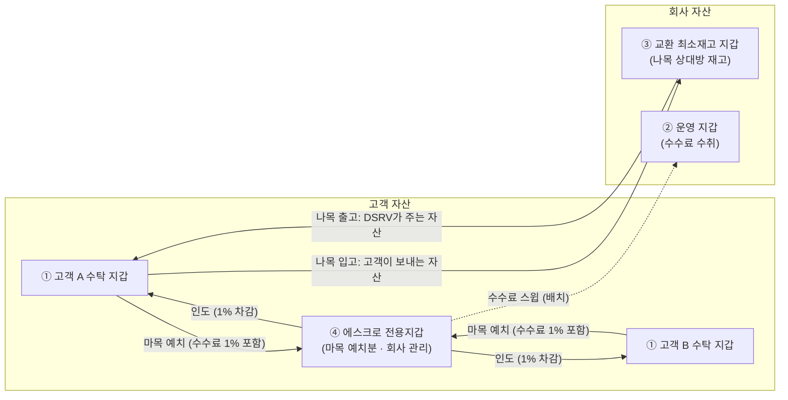
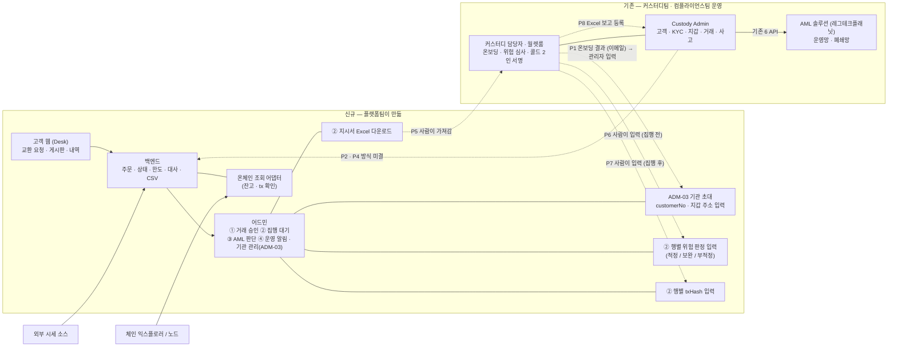
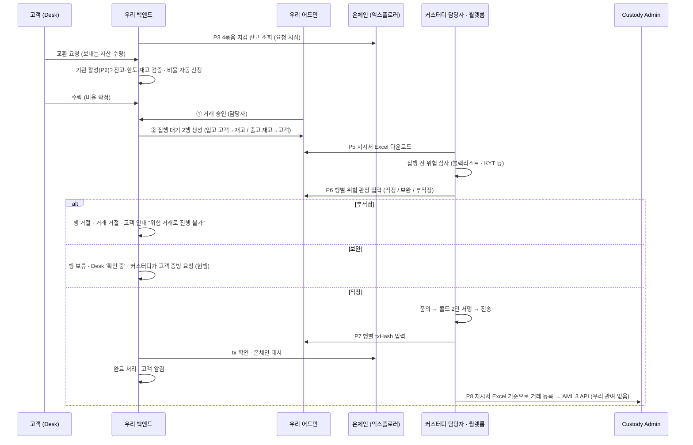
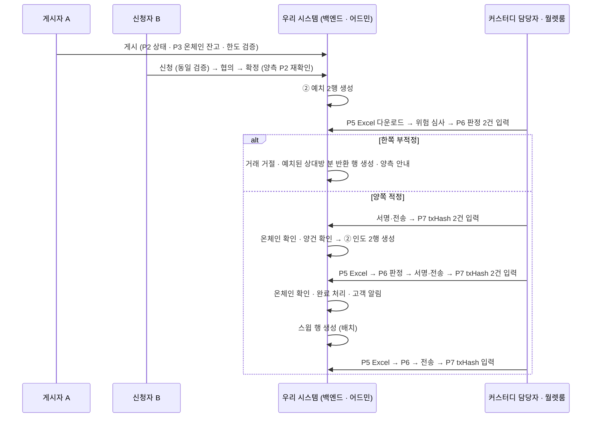
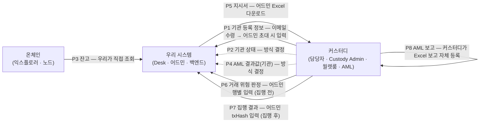
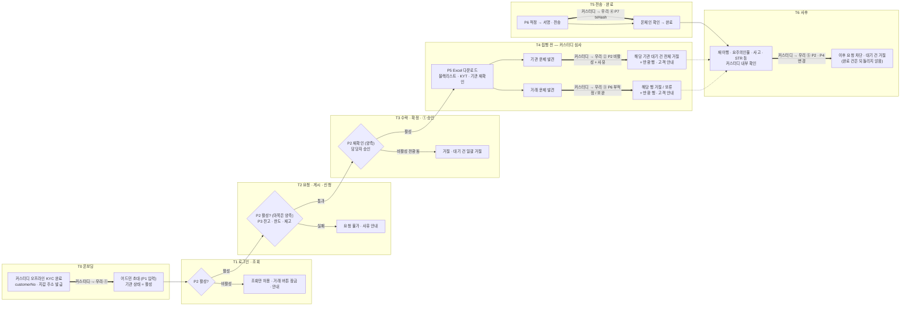
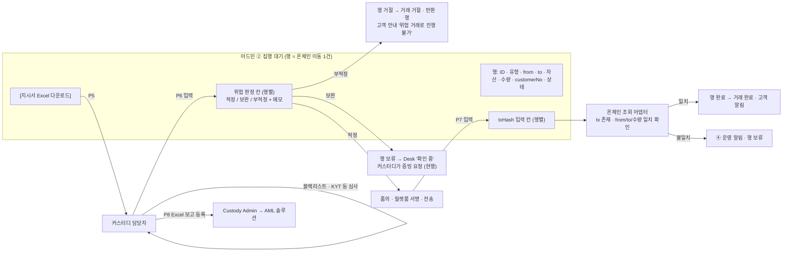
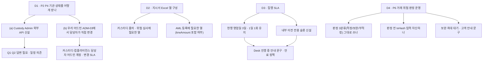

# 36. 교환·중개 시스템 ↔ 커스터디 연동 범위 — 플랫폼·커스터디·프론트엔드 회의 설명자료

작성 2026-09-07 · v4(기관 등록 정보 P1 추가 · 사고·차단 삭제 · KYC 조회 시점 다이어그램 · customerNo 일원화) · 대상 = 서비스를 처음 접하는 플랫폼 개발팀 · 함께 읽는 사람 = 커스터디팀·프론트엔드
근거 = `knowledge/09_원천자료_목록.md` §0(확정 전제) · `reference/custody/01_Custody_AML솔루션_연동API_20260701.md` · `reference/custody/Custody-M-01_…운영업무매뉴얼_v2` · 상세 분석 = `drafts/35`
Notion 게재본(다이어그램 포함): https://app.notion.com/p/3d47fc3011a981ce841fdee7ca4869ca
표기: **[사실]** 자료 확인 · **[추론]** 자료로부터 해석 · **[결정]** 오늘 정할 것 · **[확정]** 2026-09-07 기획 결정 · **[확인필요]** 커스터디팀 답변 필요

> 이 문서는 기획 산출물이다(근거 아님). 커스터디 현행은 2026-02~07월 자료 기준이므로 회의에서 현행 여부를 먼저 확인한다.
> **v2 변경**: 오가는 정보는 그대로 두고 **각각을 어떻게 주고받는지**를 확정. 시스템 간 API 후보 7개 → 최대 2개, 나머지는 **사람이 어드민 화면을 매개로** 처리.
> **v3 변경**: **거래 위험 판정**(현 P6) 추가 — 커스터디가 집행 전 블랙리스트·KYT 등 거래 위험 심사에서 문제를 확인하면 **우리 시스템에 전달**해야 우리가 해당 거래를 막고 고객에게 안내할 수 있다.
> **v4 변경**: ① **P1 기관 등록 정보** 추가 — 커스터디 오프라인 온보딩이 끝나면 **customerNo·수탁 지갑 주소**를 받아 어드민 초대 시 입력한다. 이것이 우리 시스템의 고객 온보딩이다. ② 기관 식별자를 **customerNo로 일원화**(내부 채번 ORG-NNNN 폐기). ③ **사고·차단 전달 항목 삭제**(기관 상태 변경으로 흡수). ④ KYC(기관 상태)를 **언제 조회하고 커스터디가 언제 우리에게 알려야 하는지** 다이어그램(§3-4). 정보 번호는 흐름 순서로 다시 매겼다(P1~P8).

---

## 0. 세 줄 요약

1. **만드는 것** = 커스터디 법인 고객이 쓰는 웹 하나(교환 요청·중개 게시판) + 어드민 하나. 고객·지갑·키·서명·AML 심사·보고는 **만들지 않는다.** 전부 커스터디팀이 이미 운영하는 체계(Custody Admin·월렛룸·AML 솔루션)를 쓴다.
2. **오가는 정보** = 8종(§3-3). **6종은 사람이 어드민 화면으로 주고받는다** [확정 5 + 제안 1]: 온보딩 결과 **customerNo·지갑 주소를 초대 시 입력**(P1) → 집행 지시서 **Excel 다운로드**(P5) → 커스터디가 집행 전 위험 심사 → **행별 위험 판정 입력**(P6) → 서명·전송 → **행별 txHash 입력**(P7). 잔고는 **우리가 온체인에서 직접 조회**(P3), AML 보고 데이터는 **커스터디가 지시서 Excel을 보고 Custody Admin에 직접 등록**(P8, 우리 관여 없음).
3. **시스템 간 연동 후보로 남는 것은 2종**(P2 기관 상태 · P4 AML 결과값 — 둘 다 "이 기관이 지금 거래 가능한가")이고, API로 할지 어드민 수동 설정으로 할지 오늘 정한다. 현재 자료 기준으로 우리 시스템과 Custody Admin 사이에 **존재하는 API는 없다** [사실].

---

## 1. 서비스가 무엇인지 (플랫폼팀용 1분 설명)

| 항목 | 내용 | 출처 |
|---|---|---|
| 고객 | **국내 법인**, 이미 DSRV 커스터디에 가입해 KYC(CDD)를 마친 회사. 신규 고객 유입 없음. 우리 시스템 등록은 **어드민 초대**(P1) | 09 §0 |
| 자산 | ETH · USDC · USDT (Ethereum 체인 단일) | 09 §0 |
| 서비스 ① 교환(나목) | 고객이 **DSRV와 직접** 교환. 예: 고객 USDT → DSRV, DSRV ETH → 고객. 비율은 외부 시세 + 고정 스프레드로 시스템이 자동 산정. 체결은 고객 수락 → DSRV 승인 → **커스터디 위험 심사·콜드월렛 수동 집행** | 09 §0 |
| 서비스 ② 중개(마목) | 고객 간 **게시판**. A가 "USDC 팔고 USDT 사겠다" 게시 → B 신청 → 협의 → 확정. 확정되면 양쪽이 **에스크로 전용지갑**에 예치 → 양건 확인 → 상대에게 인도 | 09 §0 |
| 한도 | 건당 1,500,000원 상당(요청 시점 KRW 환산) | 09 §0 2026-09-02(9) |
| 수수료 | 중개 1%(양 당사자 각자) · 교환은 스프레드에 포함 | 09 §0 |
| 시스템 | 고객 웹(Desk) + 어드민. 오더북·자동 매칭·자동 체결 **없음**. 핫월렛 **없음** | 09 §0 |
| 온체인 이동 | 전부 **DSRV가 관리하는 콜드 지갑 사이**의 이동. 외부 주소로 나가는 출금은 이 서비스에 없음 | 09 §0 2026-09-04(17) |

**자산이 놓이는 지갑 4묶음과 이동 경로** [사실 — 09 §0 2026-09-03(15)]

| # | 묶음 | 소유 | 용도 | 주소를 우리 시스템이 갖는 방법 |
|---|---|---|---|---|
| ① | 고객 수탁 지갑 | 고객 자산 | 현행 커스터디 지갑. **법인 1사 · 체인 1개당 1지갑**(Ethereum 단일이므로 지금은 법인당 1개, ETH·USDC·USDT 공용) **[확정]** | **기관 초대 시 입력**(P1) |
| ② | 운영 지갑 | 회사 | 수수료 수취(스윕 도착지) — **신규 생성** | 어드민 설정값 |
| ③ | 교환 최소재고 지갑 | 회사 | 나목 교환 상대방 재고 — **신규 생성** | 어드민 설정값 |
| ④ | 에스크로 전용지갑 | 고객 자산(회사 관리) | 마목 정산 예치 — **신규 생성** | 어드민 설정값 |

②③④ 생성은 커스터디팀 월렛룸 절차(작업신청 요청서 품의 → 월렛룸 → 신규지갑생성확인서)를 탄다 [사실 — 매뉴얼 2.3]. 모든 화살표는 DSRV 관리 지갑 사이의 이동이라 **외부 출금·화이트리스트가 개입하지 않는다.** 우리 시스템은 4묶음의 주소로 온체인 잔고를 직접 조회한다(§4-1 P3).

---

## 2. 시스템 구성 — 누가 무엇을 갖는가

| 데이터 | 소유 시스템 | 우리 시스템은 | 근거 |
|---|---|---|---|
| 고객 마스터(법인 정보·대표자·대리인·실소유자) | Custody Admin | **customerNo(= 우리 기관 ID) · 법인명 · 수탁 지갑 주소 · 기관 상태 · 가입자 이메일**만 보유. 개인정보 컬럼 없음. 내부 채번 ID 없음 **[확정]** | Notion 01 ②, 09 §0 (17), 2026-09-07 결정 |
| KYC·재이행·요주의인물 결과(**기관 단위**) | AML 솔루션 → Custody Admin | 결과값(활성/비활성·사유)만 수신 → P2·P4. **초기값은 '활성'**(customerNo가 발급됐다 = 온보딩 완료) **[확정]** | Notion 01 ②③ |
| 거래 위험 심사(**거래 단위** — 블랙리스트·KYT 등) | 커스터디·AML 부서 | **판정 결과만 수신** → P6. 심사 로직·솔루션은 우리에 없음 | 매뉴얼 2.6(출금 검토 3분류) · 2026-09-07 결정 |
| 지갑 주소·키 | Custody Admin·월렛룸 | ① 고객 수탁 주소는 **초대 시 입력값**(P1), ②③④는 **설정값**. 키·서명 로직 없음 | 09 §0 |
| 온체인 잔고 | 온체인(체인 자체) | **우리가 익스플로러·노드에서 직접 조회** [확정] | 2026-09-07 결정 |
| 온체인 전송 실행 | 월렛룸(사람) | 지시서 Excel 발행 + txHash 수동 입력 수신 | 09 §0 승인·통제 |
| AML 거래 보고·STR | Custody Admin → AML 솔루션 · 컴플라이언스 | **관여 없음** — 커스터디가 지시서 Excel을 보고 등록 [확정] | Notion 01 ⑤ |
| 사고·차단(압류·동결·이용 제한) | Custody Admin | **별도 항목 없음.** 결과는 P2 기관 상태 변경(비활성·동결)으로 받는다 **[확정]** | 2026-09-07 결정 |
| 주문·게시·협의·승인·집행 지시·대사·CSV | **우리** | 소유 | 09 §0 |

---

## 3. 거래 한 건이 흐르는 순서와 커스터디 접점

### 3-1. 교환(나목)

### 3-2. 중개(마목)

게시(BRK-02) → 신청·협의(BRK-03) → 확정 → **예치 2행**(A→에스크로, B→에스크로) → 양건 확인 → **인도 2행**(에스크로→B, 에스크로→A, 수수료 1% 차감) → 완료 → 수수료 **스윕**(에스크로→운영, 배치). 접점은 나목과 같고, Excel 다운로드 → 위험 판정 → txHash 입력 사이클이 **예치·인도·스윕 3번** 돈다. **예치 단계에서 한쪽이 부적정**이면 거래 거절 + 이미 예치된 상대방 분은 **반환 행**으로 돌아간다.

### 3-3. 오가는 정보 8종과 주고받는 방식 [확정 5 · 제안 1 · 결정 2]

번호는 **한 기관이 겪는 순서**다. P1(등록) → P2·P3·P4(거래 전 검증에 쓰는 값) → P5·P6·P7(집행 한 사이클) → P8(사후 보고).

| # | 정보 | 방향 | 시점 | 주고받는 방식 | 상태 | 없으면 |
|---|---|---|---|---|---|---|
| **P1** | **기관 등록 정보** — customerNo · 수탁 지갑 주소(체인별 1개) · 법인명 | 커스터디 → 우리 | 커스터디 **오프라인 온보딩 완료 후**, 우리 시스템 초대 전 | 커스터디 담당자가 **이메일 등 오프라인으로 전달** → 관리자가 어드민 **ADM-03 초대 폼**에 기관명·가입자 이메일과 함께 입력 → 초대 발송. **이것이 우리 시스템의 고객 온보딩.** 기관 상태 초기값 **'활성'**. 값 변경(주소 교체·오기)은 **고객이 커스터디에 이메일로 요청 → 커스터디가 처리**(우리 쪽 별도 변경 워크플로 없음) | **[확정]** | 지시서에 from/to 주소·customerNo를 채울 수 없고 잔고 조회 대상이 없음 |
| P2 | 기관 상태(활성 / 비활성 — 사유: 거래중지·해지·동결·재이행 미응답 등) | 커스터디 → 우리 | 상태 변경 시(초기값은 P1에서 활성) | Custody Admin API **또는** 담당자가 **우리 어드민 ADM-03에서 기관 상태를 직접 변경**. 비활성 수신 시 해당 기관 대기 건 **일괄 거절**(압류·동결 등 사고도 이 경로로 흡수) | [결정] | 거래중지·동결 고객이 요청 가능해짐 · 차단 고객의 대기 건이 집행됨 |
| P3 | 자산별 잔고 | **온체인 → 우리** | 요청·게시·신청 시 + 어드민 새로고침 | 우리가 4묶음 지갑 주소(①은 P1 입력값)로 **익스플로러·노드에서 직접 조회**. ERC-20(USDC·USDT)은 `balanceOf` 조회 · 컨펌 기준은 정책값. 예치 중·집행 중 차감은 우리 장부 | **[확정]** 커스터디가 주지 않음 | 잔고 초과 요청 발생 |
| P4 | AML 결과값 — **기관 단위**(재이행 진행 중·요주의인물·고위험) | 커스터디(AML) → 우리 | 심사 결과 변동 시 | P2와 같은 경로(상태 + 사유 코드) | [결정] | 어드민 ③ AML 판단의 기관 정보가 비어 있음 |
| P5 | 집행 지시서 | 우리 → 커스터디 | ① 승인 후 | 어드민 ② 집행 대기 **Excel 다운로드** | **[확정]** | 콜드 서명자가 무엇을 보낼지 모름 |
| **P6** | **거래 위험 판정 — 거래 단위**(블랙리스트·KYT 등 집행 전 심사 결과) | 커스터디 → 우리 | **P5 이후 · 서명 전** | 담당자가 어드민 ② 집행 대기 **행별 위험 판정 칸**에 입력: **적정 / 보완 / 부적정**(현행 출금 검토 3분류 재사용) + 내부 메모. 부적정 → 우리가 거래 거절·고객 안내 | **[제안 → 결정]** 방식은 어드민 입력 제안, API 대안 가능 | **우리가 위험 거래를 막을 근거가 없고, 고객에게 "왜 진행되지 않는지" 안내 불가** |
| P7 | 집행 결과 | 커스터디 → 우리 | 전송 후 | 담당자가 어드민 **행별 txHash 입력 칸**에 입력. 우리는 온체인에서 tx 확인 후 완료 | **[확정]** | 완료 처리·대사 불가 |
| P8 | AML 보고용 거래 데이터 | (우리 → 커스터디) | 전송 후 | **별도 전달 없음.** 커스터디가 지시서 Excel과 자기 거래 내역으로 Custody Admin에 등록 | **[확정]** | Excel에 필요한 항목이 빠지면 커스터디가 재조회 |

> **P4와 P6의 차이**: P4는 "이 **기관**이 지금 거래 가능한가"(KYC·재이행·요주의인물), P6은 "이 **건**을 보내도 되는가"(블랙리스트·KYT 등). P4는 드물게 바뀌고 P6은 **집행 행마다** 발생한다. 그래서 P2·P4는 기관 관리 화면·API 후보, P6은 집행 대기 행의 칸이다.
> **삭제된 항목**: 종전 "사고·차단(압류·동결·이용 제한)" 전달. 결과가 결국 "기관 비활성 + 사유"이므로 P2에 흡수했다 **[확정]**. 우리 시스템은 사고 유형·기간을 따로 저장하지 않는다.

### 3-4. 기관 상태(KYC)·거래 위험을 **언제 확인하고, 커스터디가 언제 우리에게 알려야 하는가**

원칙: **우리는 거래 생애주기의 매 관문에서 P2 기관 상태를 다시 본다**(캐시 없이 단일 필드 조회). **커스터디는 문제를 발견한 시점에 즉시 알린다** — 기관 문제는 P2 상태 변경으로, 거래 문제는 P6 행별 판정으로. 완료된 온체인 이동은 되돌리지 않는다.

| 시점 | 우리가 확인하는 것 | 커스터디가 우리에게 줘야 하는 것 | 없으면 |
|---|---|---|---|
| T0 온보딩 | — | **① P1** customerNo · 지갑 주소 · 법인명(이메일) | 초대 불가 |
| T1 로그인 | P2 활성 여부 | — | 비활성 기관이 요청 화면 진입 |
| T2 요청·게시·신청 | P2(마목은 양측) · P3 잔고 · 한도 · 재고 | — | 잔고 초과·비활성 기관 요청 |
| T3 수락·확정·① 승인 | P2 재확인(양측) · 담당자 승인 | — | T2~T3 사이 비활성 전환 누락 |
| **T4 집행 전** | (커스터디 심사 결과 대기 · 판정 전 txHash 입력 차단) | **② 기관 문제 → P2 비활성 + 사유** · **③ 거래 문제 → P6 부적정/보완** | **우리는 위험 거래를 막을 수도, 고객에게 안내할 수도 없음** — 이 자료의 핵심 요청 |
| T5 전송 후 | P7 txHash → 온체인 일치 | **④ P7 txHash** | 완료 처리 불가 |
| T6 사후 | P2 재확인은 다음 요청 시 자동 | **⑤ P2 · P4 변경**(재이행 미응답·요주의인물·사고·STR 후속 등) | 문제 기관의 다음 거래가 통과 |

---

## 4. 주고받는 방식별 상세

### 4-0. 기관 등록(P1) — 어드민 ADM-03 초대 폼 **[확정]**

현재 초대 폼(기관명·가입자 이메일)에 두 칸을 더한다. customerNo가 곧 우리 기관 ID다.

| 입력 칸 | 값 | 검증 | 출처·비고 |
|---|---|---|---|
| 기관명 | 커스터디 등록 법인명 그대로 | 2~50자 · 중복 불가 | 지시서 Excel 법인명 열과 커스터디 품의 서식이 어긋나지 않게 안내문 |
| 가입자 이메일 | 기관 담당자 1인 | 형식 · 중복 불가 | 기관당 가입자 1명(기존) |
| **customerNo** | 커스터디 발급 고객 식별번호 | 형식 `L-XXXXXX-XXXX` [사실 — AML API 문서 putCustomer] · 기관 간 중복 불가 | **내부 채번(ORG-NNNN) 폐기** — 화면·Excel·CSV·감사로그 식별자 전부 customerNo |
| **수탁 지갑 주소** | Ethereum 주소 1개(법인 1사 · 체인 1개당 1지갑) | `0x` + 40 hex · EIP-55 체크섬 · 다른 기관·②③④ 주소와 중복 불가 | 체인 추가 시 체인별 칸 추가 |

- 초대 발송 시 기관 상태 = **활성**(customerNo 발급 = 커스터디 CDD 완료). 종전 초기값 '심사중(EDD)'과 관련 [확인필요]는 이것으로 닫는다.
- **변경**: 주소 교체·오기·법인명 변경은 우리 화면에 수정 기능을 두지 않는다. 고객 또는 우리 운영이 **커스터디에 이메일로 요청 → 커스터디가 처리**한다. 커스터디 담당자 어드민 계정으로 값을 갱신하는 것으로 가정 [추론 — 회의에서 확인, Q8].
- 초대 후 가입자가 ONB-01~03에서 계정을 활성화하고 로그인하면 T1부터 §3-4 흐름을 탄다.

### 4-1. 사람이 어드민 ② 집행 대기 화면으로 처리하는 것 [확정 P5·P7·P3 · 제안 P6]

**행 상태 전이(안)**: 지시서 대기 → (Excel 다운로드) 위험 심사 중 → 적정: 서명 대기 → (txHash 입력) 온체인 확인 중 → 완료 / 보완: 보류 → 재판정 / 부적정: 거절(+반환 행 생성) / 만료. 기관이 P2 비활성으로 바뀌면 그 기관의 모든 대기 행은 상태와 무관하게 거절.

| # | 화면 요소 | 내용 | 결정할 세부 |
|---|---|---|---|
| P5 | **[지시서 Excel 다운로드]** 버튼 | 선택 행(또는 배치 단위)을 Excel로 내림. 열: 행 ID · 유형(입고/출고/예치/인도/반환/스윕) · from 지갑 · to 지갑 · 자산 · 수량 · 요청 기관 **customerNo**·법인명 · 승인자 ID · 승인 시각 · 만료 시각 · **요청 시점 KRW 환산**(커스터디 AML 등록 krwAmount 참고용) | 커스터디 품의 서식·위험 심사에 필요한 열 [확인필요] · 다운로드 기록(누가·언제) 보존 |
| **P6** | **위험 판정 칸**(행별) | 값 = 적정 / 보완 / 부적정 + 내부 메모(고객 미노출) + 판정자·시각. **부적정** → 행 거절 → 거래 거절 → 마목이면 상대방 예치분 반환 행 자동 생성 → 고객 안내(사유 상세 없이 "거래 위험 검토 결과 진행 불가"). **보완** → 행 보류, Desk '확인 중', 재판정 대기. **적정** → 서명 대기로 전이, txHash 입력 활성 | 판정 없이 txHash 입력을 **막을지**(제안: 막음 — 심사 전 집행 방지) · 보완의 최대 대기 기간·만료 처리 · 고객 안내 문구(AML 심사 내용 미노출 원칙 유지) · 부적정 건의 STR 연계는 커스터디 현행대로 |
| P7 | **txHash 입력 칸**(행별) | 담당자가 전송 후 입력. 온체인 조회로 tx 존재·from/to/수량 일치 확인 → 일치 시 행 완료, 불일치 시 보류 + ④ 운영 알림 | 입력 권한(커스터디 담당자 어드민 계정) · 실 가스비·서명자 ID도 입력받는지 · 입력 마감 |
| P3 | **잔고 표시 + [새로고침]** | 어드민·Desk의 잔고 = 온체인 조회값 − 우리 장부의 예치 중·집행 중 수량. 거래 요청·게시·신청 시점에 재조회해 검증. ERC-20은 `balanceOf`, 컨펌 기준 정책값 | 익스플로러 API vs 자체 노드 · 조회 실패 시 입력 비활성 · 캐시 유효 시간 |
| P8 | (없음) | 우리 화면 없음. 커스터디가 Excel + Custody Admin 거래 내역으로 등록 | Excel의 KRW 환산 열을 쓸지, 커스터디 기준가액을 쓸지 [확인필요 — 컴플라이언스] |

### 4-2. 시스템 연동 후보로 남는 2종 [결정]

| # | 정보 | (a) Custody Admin API | (b) 우리 어드민 수동 설정 | 판단 재료 |
|---|---|---|---|---|
| P2 | 기관 상태 | Custody Admin에 외부 API 신설. customerStatusCd 01~06 재사용 | 담당자가 우리 어드민 ADM-03에서 활성/비활성 + 사유 변경 | 상태 변경 빈도(낮음) · Custody Admin 외부 API 존재 여부 [확인필요 Q1] · 폐쇄망 [확인필요 Q2] · 즉시성(비활성 즉시 대기 건 거절 — 수동이면 담당자 SLA) |
| P4 | AML 결과값(기관) | 콜백 중계 | P2 변경에 사유 코드(재이행 진행 중·요주의인물·고위험) 추가 | 어드민 ③ AML 판단이 필요로 하는 것은 "이 기관 지금 거래 가능한가"와 사유 정도 |

두 정보의 공통점: **커스터디가 우리에게 알려야 하고, 빈도가 낮고, 결과가 "기관 활성/비활성 + 사유"로 수렴**한다. 따라서 (b)로 시작해 (a)는 Custody Admin 외부 API가 생길 때 붙이는 것이 **기획 제안** [추론]. P6도 같은 논리로 어드민 입력을 제안하되, 건별 빈도가 높으므로 API가 생기면 우선 전환 대상이다. P1은 초대 1회성이라 API 대상이 아니다.

### 4-3. 우리가 호출하지 않는 것

| 기존 API(Custody Admin → AML 솔루션) | 이유 |
|---|---|
| putProduct · putCustomer · getKycresultUnapproved · /callback | 고객·상품·KYC는 Custody Admin 소유. 우리는 customerNo만 P1로 받는다 |
| putAccount | 지갑 ②③④ 등록도 지갑 생성 주체(커스터디)가 한다 |
| putSendReceipt · putTransaction · putAccount(잔고) | 폐쇄망 · 호출 주체 Custody Admin. **우리는 데이터도 만들지 않는다** [확정] |
| checkAccountTrouble | 사고 등록은 Custody Admin. 우리는 결과를 P2 기관 상태로만 받는다 |
| (KYT·블랙리스트 솔루션) | 거래 위험 심사는 커스터디·AML 부서가 수행. **우리는 P6 판정 결과만 받는다** |

---

## 5. 어디까지 하는가 — 책임 경계

### 5-1. 플랫폼(백엔드)이 만드는 것 / 만들지 않는 것

| 만든다 | 만들지 않는다 |
|---|---|
| 기관 계정(로그인·2FA)·권한 · **커스터디 담당자용 어드민 계정·권한**(Excel 다운로드·위험 판정·txHash 입력·기관 상태 변경) | 고객 온보딩·KYC·재이행 |
| **ADM-03 초대 폼(기관명 · 이메일 · customerNo · 수탁 지갑 주소)** · 기관 식별자 = customerNo | 기관 정보 변경 워크플로(이메일 → 커스터디 처리) · 내부 채번 ID |
| 교환 요청·비율 산정·수락 / 게시·신청·협의·확정 상태 머신 | 지갑 생성·키 관리·서명 |
| 어드민 4섹션(① 거래 승인 ② 집행 대기 ③ AML 판단 ④ 운영 알림) | 온체인 전송 코드 |
| ② 집행 대기: **지시서 Excel 생성·다운로드 · 행별 위험 판정 입력·상태 전이(거절·보류·반환 행) · 행별 txHash 입력·검증** | 화이트리스트 · 외부 출금 |
| **온체인 조회 어댑터**(4묶음 잔고 · tx 확인) | **블랙리스트·KYT 등 거래 위험 심사 로직** · AML 솔루션 호출 · 보고 데이터 생성 · STR |
| 잔고·한도·재고·기준가 편차 검증 · **매 관문 P2 재확인** | 트래블룰 연동 |
| 온체인 대사(장부 vs 온체인) · 3면 대사 입력 | 잔고확인서·이용자명부 발급 |
| CSV 6종 · 시세 소스 어댑터·스프레드·한도 설정(ADM-03) | 개인정보 저장 · 사고 유형·기간 저장 |
| 기관 상태 단일 필드(P2·P4 — 입력 경로 무관) · 비활성 시 대기 건 일괄 거절 · 고객 안내(위험 거래 진행 불가·확인 중) | Custody Admin 연동 API(결정 전까지) |

### 5-2. 개발 원칙 7개

1. 고객 개인정보 컬럼을 두지 않는다. customerNo·법인명·지갑 주소·상태·가입자 이메일만.
2. **기관 식별자는 customerNo 하나다.** 내부 채번을 만들지 않고, 화면·Excel·CSV·감사로그가 같은 값을 쓴다.
3. 콜드 서명·온체인 전송은 우리 코드에 없다. **Excel을 내고 txHash를 받아** 온체인에서 확인한다.
4. AML 솔루션을 직접 호출하지 않고, 보고용 데이터도 만들지 않는다. 지시서 Excel이 커스터디의 심사·등록 근거가 되므로 **Excel 열을 커스터디와 합의**한다.
5. 잔고의 원천은 온체인이다. 커스터디 시스템에 묻지 않는다. 조회 실패 시 추측값을 쓰지 않고 입력을 막는다.
6. 기관 상태(P2·P4)는 단일 필드로 두고 입력 경로(API·수동)는 뒤에서 바꿀 수 있게 한다. 사고·차단도 이 필드로 받는다. **거래 생애주기의 매 관문(로그인·요청·확정·승인)에서 다시 읽는다.**
7. **거래 위험 심사는 우리가 하지 않고 판정만 받는다(P6).** 판정 값(적정/보완/부적정)에 따른 상태 전이·반환 행·고객 안내는 우리 책임이고, 내부 메모·심사 내용은 고객에게 노출하지 않는다.

### 5-3. 커스터디팀이 하는 것

| 항목 | 현행 절차 | 교환·중개에서 달라지는 점 |
|---|---|---|
| 고객 온보딩 | 계약 → 오프라인 KYC(CDD) → 수탁 지갑 생성 → 신규 지갑 생성 확인서 메일 [사실 — 매뉴얼 3-1] | + **customerNo·지갑 주소·법인명을 우리 운영에 전달**(P1). 변경 요청은 이메일로 받아 처리 |
| 지갑 ②③④ 생성 | 작업신청 요청서 품의 → 월렛룸 → 신규지갑생성확인서 | 1회원 1지갑 정책의 예외(회사 소유 지갑 3종) [결정] |
| 집행 전 위험 심사 | 출금 사전 검증 이상 내역을 AML 부서에 공유 → 검토 **적정 / 보완 / 부적정** [사실 — 매뉴얼 2.6] | 대상이 내부 이전 행. **판정 결과를 우리 어드민 행에 입력**(P6) — 종전에는 커스터디 내부에서만 끝났음 |
| 집행 | 고객 신청서 → 품의 4종(영업일 3일) → 최종 승인 → 월렛룸 2인 서명 | 기점이 **우리 어드민에서 내린 지시서 Excel** [확정]. 리드타임 재정의 [결정] |
| 집행 결과 기록 | Custody Admin 거래 내역 반영 | + **우리 어드민에 txHash 입력** [확정] — 누가·언제 [확인필요] |
| AML 보고 | Custody Admin 자산 구분 승인 → AML 3 API | 내부 이전도 같은 절차. 근거 자료 = 지시서 Excel |
| 기관 상태 통지 | Admin 내부(customerStatusCd · 사고 등록) | P2·P4를 우리에게 알림 — 방식 [결정]. 사고·압류·동결도 '비활성 + 사유'로 |

### 5-4. 프론트엔드가 알아야 할 의존 지점

| 화면 | 의존 데이터 | 화면 동작 |
|---|---|---|
| 어드민 ADM-03 기관 초대 | P1 | 초대 폼 4칸(기관명 · 이메일 · **customerNo** · **수탁 지갑 주소**) + 형식·중복 검증 · 목록 식별자 = customerNo · 초기 상태 '활성' · 수정 버튼 없음(변경은 커스터디 이메일 요청 안내) |
| 로그인 후 전체 | P2 기관 상태 = 활성 | 비활성이면 모든 거래 버튼 비활성 + 안내. 화면 진입마다 재확인 |
| 대시보드(DASH-01) · 교환 요청(EXC-01) · 게시(BRK-02) · 신청(BRK-03) | P2 · P3 온체인 잔고 − 예치 중·집행 중 | 요청·게시·신청 시점 재조회. 조회 실패 시 입력 비활성(추측값 표시 금지) · 조회 시각 표기 |
| 진행 중(EXC-03) · 예치·인도 진행 | P6 판정 · P7 txHash · P2 | 판정 전 '집행 대기' → 보완 '확인 중' → 부적정 **'진행 불가(거래 위험 검토 결과)'** + 반환 안내 → 적정·txHash 후 '완료'. 기관 비활성 전환 시 '진행 불가(기관 상태)'. 사유 상세·심사 내용 미노출 |
| 어드민 ② 집행 대기 | P5·P6·P7 | **[지시서 Excel 다운로드]** · **행별 위험 판정 칸**(적정/보완/부적정 + 메모, 판정 전 txHash 입력 비활성) · **행별 txHash 입력 칸** + 검증 결과 · 다운로드·판정·입력 이력 |
| 어드민 ③ AML 판단 | P4(기관) · P6(거래) | 기관 상태·사유 + 거래별 판정 현황(보완·부적정 목록). 값 없으면 '수신 대기', 자동 승인·거절 없음 |
| 어드민 ADM-03 기관 상태 | P2·P4 | (b) 채택 시: 활성/비활성 + 사유 코드, 변경 이력. 비활성 전환 → 대기 건 일괄 거절 + 반환 행 |
| 어드민 ④ 운영 알림 | P2 비활성 전환 · P6 부적정 · txHash 불일치 | 기관 비활성으로 대기 건 일괄 거절됨 · 부적정 판정 발생 · txHash 검증 불일치 |

고객 화면에 **시세 소스명·AML 심사 내용·내부 계정명은 노출하지 않는다.** [사실 — 09 §0 2026-09-02] → P6 고객 안내는 "거래 위험 검토 결과 진행 불가" 수준에서 멈춘다.

---

## 6. 오늘 정할 것

| # | 결정 | 기획 제안 [추론] | 영향 |
|---|---|---|---|
| D1 | P2·P4 수신 방식 | (b) 어드민 수동 설정으로 시작, Custody Admin 외부 API가 생기면 (a) 전환 | ADM-03 기관 상태 변경 범위 · 커스터디 담당자 계정 |
| D2 | 지시서 Excel 열 | §4-1 P5 열 + 커스터디 요청 열 | Excel 생성 규칙 |
| D3 | 집행 SLA | 커스터디 답변(Q5) 후 | Desk 안내 문구 · 만료 정책 · 정산 배치 주기 |
| **D4** | **P6 거래 위험 판정 운영** | 현행 3분류 재사용 · 판정 전 txHash 입력 차단 · 보완은 만료 시각까지 대기 후 자동 거절 · 고객 안내는 사유 미노출 | 집행 대기 행 상태 머신 · 반환 행 규칙 · Desk 상태 문구 · ③ AML 판단 화면 |

**이미 정한 것(2026-09-07 확정, 회의에서 공유만)**: P1 초대 폼 입력·customerNo 일원화·지갑 법인당 체인별 1개·기관 상태 초기값 활성·변경은 커스터디 이메일 요청 · P3 온체인 직접 조회 · P5 Excel · P7 txHash · P8 미제공 · 사고·차단 항목 삭제.
**결정을 기다리지 않고 시작할 수 있는 것**: 기관 계정 · ADM-03 초대 폼 4칸 · 화면 · 주문/게시/신청 상태 머신 · 어드민 4섹션 · **② 집행 대기 Excel 다운로드·위험 판정 칸·txHash 입력 칸과 행 상태 머신** · **온체인 조회 어댑터** · 시세 어댑터 · 한도 판정 · CSV · 기관 상태 단일 필드 + 매 관문 재확인.
**결정 후 착수**: Excel 열 확정 · 기관 상태 입력 경로(API vs 수동) · 지갑 ②③④ 주소 설정 · 진행 중·진행 불가 안내 문구 · 보완 대기 정책.

---

## 7. 커스터디팀에 오늘 확인할 질문

| # | 질문 | 관련 |
|---|---|---|
| Q1 | Custody Admin에 외부 시스템용 API가 있나. 없다면 신설 가능한 팀·일정은 | D1 |
| Q2 | Custody Admin은 폐쇄망 안에 있나. 우리 어드민에 커스터디 담당자가 접속(Excel 다운로드·판정·txHash 입력·기관 상태 변경)하는 데 망 제약이 있나 | D1 · P5·P6·P7 · ISMS |
| Q3 | 지시서 Excel에 어떤 열이 있어야 현행 품의(작업신청 요청서·작업계획서·가스비 요청)·위험 심사·AML 등록을 재입력 없이 할 수 있나 | D2 |
| Q4 | txHash 입력을 누가 언제 하나(월렛룸 직후? 작업완료보고 후?). 실 가스비·서명자 ID도 입력 가능한가 | P7 |
| Q5 | 1일 1회·영업일 3일 정책의 근거와 완화 가능성. 내부 이전 전용 슬롯을 둘 수 있나 | D3 |
| Q6 | 회사 소유 지갑 ②③④를 1회원 1지갑 정책 예외로 생성 가능한가. AML 솔루션에 계좌 등록하나 | 지갑 4묶음 |
| Q7 | 커스터디 출금 한도(지갑·자산별)를 내부 이전에도 적용하나 | 한도 판정 |
| **Q8** | **온보딩 완료 후 customerNo·수탁 지갑 주소·법인명을 우리 운영에 어떤 형식·시점으로 전달하나(신규 지갑 생성 확인서 메일에 포함?). 변경 요청(주소 교체·오기)을 이메일로 받았을 때 우리 어드민 값 갱신은 커스터디 담당자 계정이 하나** | P1 · §4-0 |
| Q9 | 내부 이전(입고·출고·예치·인도·반환·스윕)을 Custody Admin에 어떤 거래유형으로 등록할 계획인가(01 입금/02 출금만 존재) | P8 |
| **Q10** | **내부 이전 행에 대한 집행 전 위험 심사(블랙리스트·KYT 등)를 현행 출금과 같은 절차·3분류로 하나. 소요 시간은. 판정 결과를 우리 어드민 행에 입력하는 역할을 맡을 수 있나. 보완 시 고객 증빙 요청은 현행처럼 커스터디가 하나. 심사 중 기관 문제를 발견하면 P2 비활성으로 즉시 알릴 수 있나** | D4 · P6 · §3-4 T4 |
| Q11 | 운영매뉴얼 공유용에서 제외된 3장·별첨과 Custody-M-07 위기 대응 매뉴얼 공유 가능 여부 | 정산 배치 |

---

## 8. 이 문서와 다른 문서의 관계

- 접점별 상세·상충 14건·부서별 요청 자료 → `drafts/35` (접점별 수신 방식은 이 문서 v4가 우선. §6-6 "내부 이전에 KYT 대상 없음"은 **커스터디가 거래 단위 심사를 수행해 판정을 준다**는 전제로 정정 대상)
- 확정 전제 정본 → `knowledge/09` §0 2026-09-07(21) 블록
- 기획서 → `drafts/33` v2.1(§E·F·H·N·§4·WAL·POL·CMP 재기술)
- 어드민 화면 → `drafts/storyboard` ADM-03(초대 폼 4칸·customerNo·초기 활성) · ADM-02(② 집행 대기 Excel·위험 판정·txHash) · `drafts/34`는 폐기본
- AML API 원문 → `reference/custody/01`
