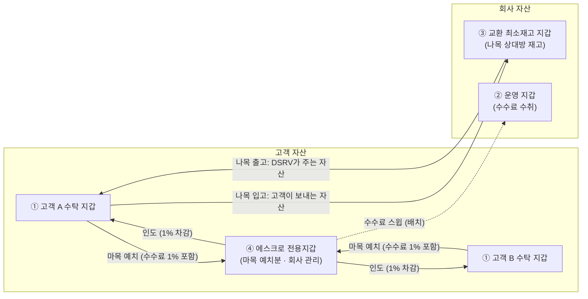
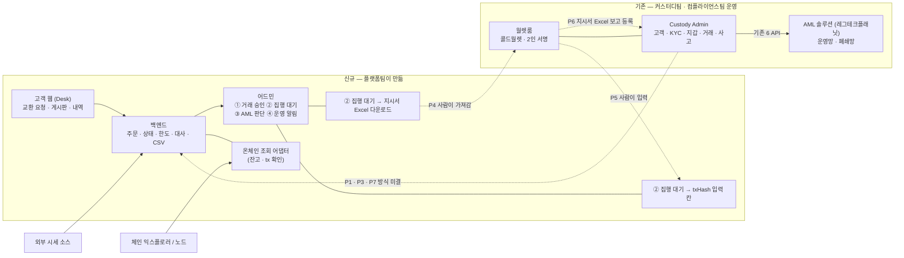
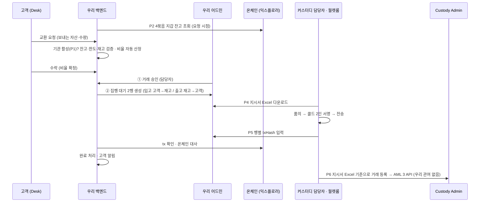
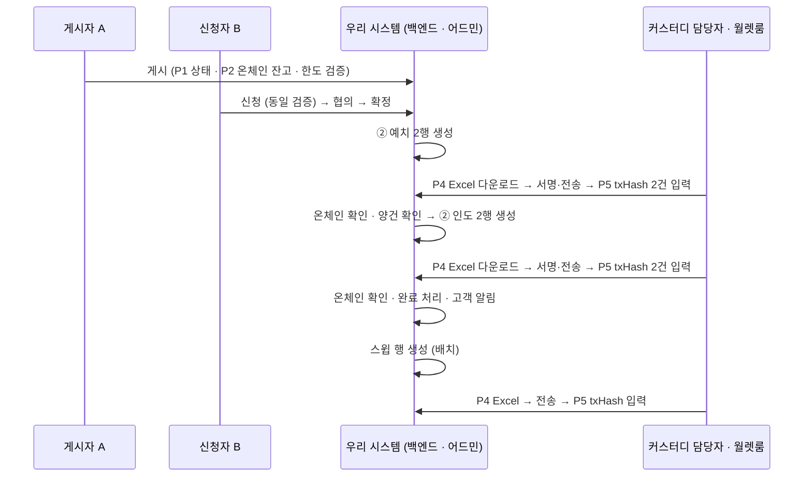
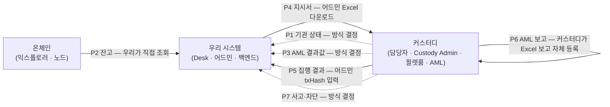
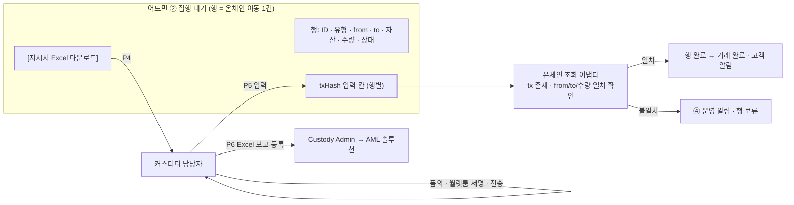
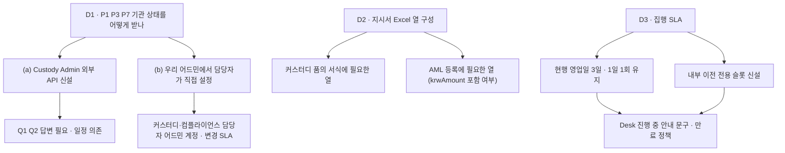

# 36. 교환·중개 시스템 ↔ 커스터디 연동 범위 — 플랫폼·커스터디·프론트엔드 회의 설명자료

작성 2026-09-07 · v2(같은 날 결정 4건 반영) · 대상 = 서비스를 처음 접하는 플랫폼 개발팀 · 함께 읽는 사람 = 커스터디팀·프론트엔드
근거 = `knowledge/09_원천자료_목록.md` §0(확정 전제) · `reference/custody/01_Custody_AML솔루션_연동API_20260701.md` · `reference/custody/Custody-M-01_…운영업무매뉴얼_v2` · 상세 분석 = `drafts/35`
Notion 게재본(다이어그램 포함): https://app.notion.com/p/3d47fc3011a981ce841fdee7ca4869ca
표기: **[사실]** 자료 확인 · **[추론]** 자료로부터 해석 · **[결정]** 오늘 정할 것 · **[확정]** 2026-09-07 기획 결정 · **[확인필요]** 커스터디팀 답변 필요

> 이 문서는 기획 산출물이다(근거 아님). 커스터디 현행은 2026-02~07월 자료 기준이므로 회의에서 현행 여부를 먼저 확인한다.
> **v2 변경**: 오가는 정보 7종은 그대로 두고, **각각을 어떻게 주고받는지**를 확정했다. 그 결과 시스템 간 API 후보는 7개 → **최대 3개**(P1·P3·P7)로 줄었고, 나머지 4개는 **사람이 어드민 화면을 매개로** 처리한다.

---

## 0. 세 줄 요약

1. **만드는 것** = 커스터디 법인 고객이 쓰는 웹 하나(교환 요청·중개 게시판) + 어드민 하나. 고객·지갑·키·서명·AML 보고는 **만들지 않는다.** 전부 커스터디팀이 이미 운영하는 체계(Custody Admin·월렛룸·AML 솔루션)를 쓴다.
2. **오가는 정보** = 7종(§3). 그중 **4종은 사람이 어드민 화면으로 주고받는다** [확정]: 집행 지시서는 어드민에서 **Excel 다운로드**, 집행 결과는 어드민의 **txHash 입력 칸**, 잔고는 **우리가 온체인에서 직접 조회**, AML 보고 데이터는 **커스터디가 지시서 Excel을 보고 Custody Admin에 직접 등록**(우리가 따로 주지 않음).
3. **시스템 간 연동이 남는 것은 3종**(P1 기관 상태 · P3 AML 결과값 · P7 사고·차단)이고, 이것도 API로 할지 어드민 수동 설정으로 할지 오늘 정한다. 현재 자료 기준으로 우리 시스템과 Custody Admin 사이에 **존재하는 API는 없다** [사실].

---

## 1. 서비스가 무엇인지 (플랫폼팀용 1분 설명)

| 항목 | 내용 | 출처 |
|---|---|---|
| 고객 | **국내 법인**, 이미 DSRV 커스터디에 가입해 KYC(CDD)를 마친 회사. 신규 고객 유입 없음 | 09 §0 |
| 자산 | ETH · USDC · USDT (Ethereum 체인 단일) | 09 §0 |
| 서비스 ① 교환(나목) | 고객이 **DSRV와 직접** 교환. 예: 고객 USDT → DSRV, DSRV ETH → 고객. 비율은 외부 시세 + 고정 스프레드로 시스템이 자동 산정. 체결은 고객 수락 → DSRV 승인 → **커스터디 콜드월렛 수동 집행** | 09 §0 |
| 서비스 ② 중개(마목) | 고객 간 **게시판**. A가 "USDC 팔고 USDT 사겠다" 게시 → B 신청 → 협의 → 확정. 확정되면 양쪽이 **에스크로 전용지갑**에 예치 → 양건 확인 → 상대에게 인도 | 09 §0 |
| 한도 | 건당 1,500,000원 상당(요청 시점 KRW 환산) | 09 §0 2026-09-02(9) |
| 수수료 | 중개 1%(양 당사자 각자) · 교환은 스프레드에 포함 | 09 §0 |
| 시스템 | 고객 웹(Desk) + 어드민. 오더북·자동 매칭·자동 체결 **없음**. 핫월렛 **없음** | 09 §0 |
| 온체인 이동 | 전부 **DSRV가 관리하는 콜드 지갑 사이**의 이동. 외부 주소로 나가는 출금은 이 서비스에 없음 | 09 §0 2026-09-04(17) |

**자산이 놓이는 지갑 4묶음과 이동 경로** [사실 — 09 §0 2026-09-03(15)]

| # | 묶음 | 소유 | 용도 | 신규 생성 |
|---|---|---|---|---|
| ① | 고객 수탁 지갑 | 고객 자산 | 현행 커스터디 지갑. 고객 1사·자산 1종당 1지갑 | 기존 |
| ② | 운영 지갑 | 회사 | 수수료 수취(스윕 도착지) | **필요** |
| ③ | 교환 최소재고 지갑 | 회사 | 나목 교환 상대방 재고 | **필요** |
| ④ | 에스크로 전용지갑 | 고객 자산(회사 관리) | 마목 정산 예치 | **필요** |

②③④ 생성은 커스터디팀 월렛룸 절차(작업신청 요청서 품의 → 월렛룸 → 신규지갑생성확인서)를 탄다 [사실 — 매뉴얼 2.3]. 모든 화살표는 DSRV 관리 지갑 사이의 이동이라 **외부 출금·화이트리스트가 개입하지 않는다.** 우리 시스템은 4묶음의 **주소를 설정값으로** 갖고, 이 주소로 온체인 잔고를 직접 조회한다(§4).

---

## 2. 시스템 구성 — 누가 무엇을 갖는가

| 데이터 | 소유 시스템 | 우리 시스템은 | 근거 |
|---|---|---|---|
| 고객 마스터(법인 정보·대표자·대리인·실소유자) | Custody Admin | **식별자(customerNo)·법인명·상태만** 보유. 개인정보 컬럼 없음 | Notion 01 ②, 09 §0 (17) |
| KYC·재이행·요주의인물 결과 | AML 솔루션 → Custody Admin | 결과값(활성/비활성·고위험 여부)만 수신 | Notion 01 ②③ |
| 지갑 주소·키 | Custody Admin·월렛룸 | 주소를 **설정값**으로 보유. 키·서명 로직 없음 | 09 §0 |
| 온체인 잔고 | 온체인(체인 자체) | **우리가 익스플로러·노드에서 직접 조회** [확정] | 2026-09-07 결정 |
| 온체인 전송 실행 | 월렛룸(사람) | 지시서 Excel 발행 + txHash 수동 입력 수신 | 09 §0 승인·통제 |
| AML 거래 보고·STR | Custody Admin → AML 솔루션 · 컴플라이언스 | **관여 없음** — 커스터디가 지시서 Excel을 보고 등록 [확정] | Notion 01 ⑤ |
| 주문·게시·협의·승인·집행 지시·대사·CSV | **우리** | 소유 | 09 §0 |

---

## 3. 거래 한 건이 흐르는 순서와 커스터디 접점

### 3-1. 교환(나목)

### 3-2. 중개(마목)

게시(BRK-02) → 신청·협의(BRK-03) → 확정 → **예치 2행**(A→에스크로, B→에스크로) → 양건 확인 → **인도 2행**(에스크로→B, 에스크로→A, 수수료 1% 차감) → 완료 → 수수료 **스윕**(에스크로→운영, 배치). 접점은 나목과 같고, Excel 다운로드 → txHash 입력 사이클이 **예치·인도·스윕 3번** 돈다.

### 3-3. 오가는 정보 7종과 주고받는 방식 [확정 4 · 결정 3]

| # | 정보 | 방향 | 주고받는 방식 | 상태 | 없으면 |
|---|---|---|---|---|---|
| P1 | 기관 상태(활성/거래중지/해지/동결) | 커스터디 → 우리 | Custody Admin API **또는** 커스터디·컴플라이언스 담당자가 **우리 어드민에서 기관 상태를 직접 설정** | [결정] | 거래중지·동결 고객이 요청 가능해짐 |
| P2 | 자산별 잔고 | **온체인 → 우리** | 우리가 4묶음 지갑 주소로 **익스플로러·노드에서 직접 조회**. 시점 = 거래 요청·게시·신청 시 + 어드민 새로고침. 예치 중·집행 중 차감은 우리 장부에서 계산 | **[확정]** 커스터디가 주지 않음 | 잔고 초과 요청 발생 |
| P3 | AML 결과값(재이행 진행 중·요주의인물·고위험) | 커스터디(AML) → 우리 | P1과 같은 경로로 묶는 것이 자연스러움(API 또는 어드민 수동 설정) | [결정] | 어드민 ③ AML 판단 섹션이 비어 있음 |
| P4 | 집행 지시서 | 우리 → 커스터디 | 어드민 ② 집행 대기에서 **Excel 다운로드**, 커스터디 담당자가 가져가 품의·서명에 사용 | **[확정]** | 콜드 서명자가 무엇을 보낼지 모름 |
| P5 | 집행 결과 | 커스터디 → 우리 | 커스터디 담당자가 어드민 ② 집행 대기의 **행별 txHash 입력 칸**에 입력. 우리는 온체인에서 해당 tx를 확인해 완료 처리 | **[확정]** | 완료 처리·대사 불가 |
| P6 | AML 보고용 거래 데이터 | (우리 → 커스터디) | **별도 전달 없음.** 커스터디가 지시서 Excel과 자기 거래 내역으로 Custody Admin에 등록 → AML 솔루션 호출은 현행대로 | **[확정]** | Excel에 필요한 항목이 빠지면 커스터디가 재조회 |
| P7 | 사고·차단(압류·동결·이용 제한) | 커스터디 → 우리 | P1과 같은 경로. 수신 시 해당 기관 대기 건 일괄 거절 | [결정] | 차단 고객의 대기 건이 집행됨 |

---

## 4. 주고받는 방식별 상세

### 4-1. 사람이 어드민 화면으로 처리하는 4종 [확정]

| # | 화면 요소 | 내용 | 결정할 세부 |
|---|---|---|---|
| P4 | **[지시서 Excel 다운로드]** 버튼 | 선택 행(또는 배치 단위)을 Excel로 내림. 열: 행 ID · 유형(입고/출고/예치/인도/반환/스윕) · from 지갑 · to 지갑 · 자산 · 수량 · 요청 기관 customerNo·법인명 · 승인자 ID · 승인 시각 · 만료 시각 · **요청 시점 KRW 환산**(커스터디 AML 등록 krwAmount 참고용) | 커스터디 품의 서식에 필요한 열 [확인필요 — 커스터디] · 다운로드 기록(누가·언제) 보존 |
| P5 | **txHash 입력 칸**(행별) | 커스터디 담당자가 전송 후 입력. 입력 시 온체인 조회로 tx 존재·from/to/수량 일치 확인 → 일치 시 행 완료, 불일치 시 보류 + ④ 운영 알림 | 입력 권한(커스터디 담당자 어드민 계정 필요) · 실 가스비·서명자 ID도 입력받는지 · 입력 마감(만료) |
| P2 | **잔고 표시 + [새로고침]** | 어드민·Desk의 잔고는 온체인 조회값 − 우리 장부의 예치 중·집행 중 수량. 거래 요청·게시·신청 시점에 재조회해 검증 | 익스플로러 API vs 자체 노드 · 조회 실패 시 입력 비활성 · 캐시 유효 시간 |
| P6 | (없음) | 우리 화면 없음. 커스터디가 Excel + Custody Admin 거래 내역으로 등록 | Excel의 KRW 환산 열을 쓸지, 커스터디 기준가액을 쓸지 [확인필요 — 컴플라이언스] |

### 4-2. 시스템 연동 후보로 남는 3종 [결정]

| # | 정보 | (a) Custody Admin API | (b) 우리 어드민 수동 설정 | 판단 재료 |
|---|---|---|---|---|
| P1 | 기관 상태 | Custody Admin에 외부 API 신설. customerStatusCd 01~06 재사용 | 커스터디·컴플라이언스 담당자가 우리 어드민 기관 관리 화면에서 활성/비활성 토글 | 상태 변경 빈도(낮음 — 재이행·차단 시) · Custody Admin 외부 API 존재 여부 [확인필요 Q1] · 폐쇄망 [확인필요 Q2] |
| P3 | AML 결과값 | 콜백 중계 | P1 토글에 사유 코드(재이행 진행 중·요주의인물·고위험) 추가 | 어드민 ③ AML 판단이 필요로 하는 것은 "이 기관 지금 거래 가능한가"와 사유 정도 |
| P7 | 사고·차단 | checkAccountTrouble 필드 재사용 | P1 토글로 '동결' 설정 + 시작·종료일 | 즉시성 요구(차단 즉시 대기 건 거절) — 수동이면 담당자 SLA 필요 |

세 정보의 공통점: **커스터디가 우리에게 알려야 하고, 빈도가 낮고, 결과가 "기관 활성/비활성 + 사유"로 수렴**한다. 따라서 (b)로 시작해 (a)는 Custody Admin 외부 API가 생길 때 붙이는 것이 **기획 제안** [추론]. 백엔드는 기관 상태를 **입력 경로 무관한 단일 상태 필드**로 두면 어느 쪽이든 된다.

### 4-3. 우리가 호출하지 않는 것

| 기존 API(Custody Admin → AML 솔루션) | 이유 |
|---|---|
| putProduct · putCustomer · getKycresultUnapproved · /callback | 고객·상품·KYC는 Custody Admin 소유. 교환·중개를 AML 솔루션 '상품'으로 등록하는지도 커스터디·컴플라이언스 결정 |
| putAccount | 지갑 ②③④ 등록도 지갑 생성 주체(커스터디)가 한다 |
| putSendReceipt · putTransaction · putAccount(잔고) | 폐쇄망 · 호출 주체 Custody Admin. **우리는 데이터도 만들지 않는다** [확정] |
| checkAccountTrouble | 사고 등록은 Custody Admin. 우리는 P7로 결과만 받는다 |

---

## 5. 어디까지 하는가 — 책임 경계

### 5-1. 플랫폼(백엔드)이 만드는 것 / 만들지 않는 것

| 만든다 | 만들지 않는다 |
|---|---|
| 기관 계정(로그인·2FA)·권한 · **커스터디 담당자용 어드민 계정·권한**(Excel 다운로드·txHash 입력) | 고객 온보딩·KYC·재이행 |
| 교환 요청·비율 산정·수락 / 게시·신청·협의·확정 상태 머신 | 지갑 생성·키 관리·서명 |
| 어드민 4섹션(① 거래 승인 ② 집행 대기 ③ AML 판단 ④ 운영 알림) | 온체인 전송 코드 |
| ② 집행 대기: **지시서 Excel 생성·다운로드 · 행별 txHash 입력·검증** | 화이트리스트 · 외부 출금 |
| **온체인 조회 어댑터**(4묶음 잔고 · tx 확인) | AML 솔루션 호출 · 보고 데이터 생성 · STR |
| 잔고·한도·재고·기준가 편차 검증 | 트래블룰 연동 |
| 온체인 대사(장부 vs 온체인) · 3면 대사 입력 | 잔고확인서·이용자명부 발급 |
| CSV 6종 · 시세 소스 어댑터·스프레드·한도 설정(ADM-03) | 개인정보 저장 |
| 기관 상태 필드(P1·P3·P7 — 입력 경로 무관) | Custody Admin 연동 API(결정 전까지) |

### 5-2. 개발 원칙 5개

1. 고객 개인정보 컬럼을 두지 않는다. customerNo·법인명·상태만.
2. 콜드 서명·온체인 전송은 우리 코드에 없다. **Excel을 내고 txHash를 받아** 온체인에서 확인한다.
3. AML 솔루션을 직접 호출하지 않고, 보고용 데이터도 만들지 않는다. 지시서 Excel이 커스터디의 등록 근거가 되므로 **Excel 열을 커스터디와 합의**한다.
4. 잔고의 원천은 온체인이다. 커스터디 시스템에 묻지 않는다. 조회 실패 시 추측값을 쓰지 않고 입력을 막는다.
5. 기관 상태(P1·P3·P7)는 단일 필드로 두고 입력 경로(API·수동)는 뒤에서 바꿀 수 있게 한다.

### 5-3. 커스터디팀이 하는 것

| 항목 | 현행 절차 | 교환·중개에서 달라지는 점 |
|---|---|---|
| 지갑 ②③④ 생성 | 작업신청 요청서 품의 → 월렛룸 → 신규지갑생성확인서 | 1회원 1지갑 정책의 예외(회사 소유 지갑 3종) [결정] |
| 집행 | 고객 신청서 → 품의 4종(영업일 3일) → AML 검토 → 최종 승인 → 월렛룸 2인 서명 | 기점이 **우리 어드민에서 내린 지시서 Excel** [확정]. 리드타임(현행 영업일 3일·1일 1회 vs 우리 정산 배치 1영업일 3회) 재정의 [결정] |
| 집행 결과 기록 | Custody Admin 거래 내역 반영 | + **우리 어드민에 txHash 입력** [확정] — 누가·언제(월렛룸 직후?) [확인필요] |
| AML 보고 | Custody Admin 자산 구분 승인 → AML 3 API | 내부 이전도 같은 절차. 근거 자료 = 지시서 Excel. 거래유형(01 입금/02 출금만) 표현은 커스터디·컴플라이언스 내부 결정 |
| 기관 상태 통지 | Admin 내부 | P1·P3·P7을 우리에게 알림 — 방식 [결정] |

### 5-4. 프론트엔드가 알아야 할 의존 지점

| 화면 | 의존 데이터 | 화면 동작 |
|---|---|---|
| 로그인 후 전체 | P1 기관 상태 = 활성 | 비활성이면 모든 거래 버튼 비활성 + 안내 |
| 대시보드(DASH-01) · 교환 요청(EXC-01) · 게시(BRK-02) · 신청(BRK-03) | P2 온체인 잔고 − 예치 중·집행 중 | 요청·게시·신청 시점 재조회. 조회 실패 시 입력 비활성(추측값 표시 금지) · 조회 시각 표기 |
| 진행 중(EXC-03) · 예치·인도 진행 | P5 txHash 입력·온체인 확인 | 입력 전까지 '집행 대기' 고정. 예상 소요 문구는 커스터디 SLA 결정 후 확정 |
| 어드민 ② 집행 대기 | P4·P5 | **[지시서 Excel 다운로드]** 버튼(선택 행·배치) · **행별 txHash 입력 칸** + 검증 결과 표시(일치/불일치/확인 중) · 다운로드·입력 이력 |
| 어드민 기관 관리 | P1·P3·P7 | (b) 채택 시: 기관 상태 토글 + 사유 코드 + 시작·종료일, 변경 이력 |
| 어드민 ③ AML 판단 | P3 | 값 없으면 '수신 대기' 표시, 자동 승인·거절 없음 |
| 어드민 ④ 운영 알림 | P7 · txHash 불일치 | 차단 수신 시 해당 기관 대기 건 일괄 거절 + 반환 행 · txHash 검증 불일치 알림 |

고객 화면에 **시세 소스명·AML 심사 내용·내부 계정명은 노출하지 않는다.** [사실 — 09 §0 2026-09-02]

---

## 6. 오늘 정할 것

| # | 결정 | 기획 제안 [추론] | 영향 |
|---|---|---|---|
| D1 | P1·P3·P7 수신 방식 | (b) 어드민 수동 설정으로 시작, Custody Admin 외부 API가 생기면 (a) 전환 | 어드민 기관 관리 화면 범위 · 커스터디 담당자 계정 |
| D2 | 지시서 Excel 열 | §4-1 P4 열 + 커스터디 요청 열 | Excel 생성 규칙 |
| D3 | 집행 SLA | 커스터디 답변(Q5) 후 | Desk 안내 문구 · 만료 정책 · 정산 배치 주기 |

**결정을 기다리지 않고 시작할 수 있는 것**: 기관 계정 · 화면 · 주문/게시/신청 상태 머신 · 어드민 4섹션 · **② 집행 대기 Excel 다운로드·txHash 입력 칸** · **온체인 조회 어댑터** · 시세 어댑터 · 한도 판정 · CSV · 기관 상태 단일 필드.
**결정 후 착수**: Excel 열 확정 · 기관 상태 입력 경로(API vs 토글) · 지갑 ②③④ 주소 설정 · 진행 중 안내 문구.

---

## 7. 커스터디팀에 오늘 확인할 질문

| # | 질문 | 관련 |
|---|---|---|
| Q1 | Custody Admin에 외부 시스템용 API가 있나. 없다면 신설 가능한 팀·일정은 | D1 |
| Q2 | Custody Admin은 폐쇄망 안에 있나. 우리 어드민에 커스터디 담당자가 접속(Excel 다운로드·txHash 입력)하는 데 망 제약이 있나 | D1 · P4·P5 · ISMS |
| Q3 | 지시서 Excel에 어떤 열이 있어야 현행 품의(작업신청 요청서·작업계획서·가스비 요청)와 AML 등록을 재입력 없이 할 수 있나 | D2 |
| Q4 | txHash 입력을 누가 언제 하나(월렛룸 직후? 작업완료보고 후?). 실 가스비·서명자 ID도 입력 가능한가 | P5 |
| Q5 | 1일 1회·영업일 3일 정책의 근거와 완화 가능성. 내부 이전 전용 슬롯을 둘 수 있나 | D3 |
| Q6 | 회사 소유 지갑 ②③④를 1회원 1지갑 정책 예외로 생성 가능한가. AML 솔루션에 계좌 등록하나 | 지갑 4묶음 |
| Q7 | 커스터디 출금 한도(지갑·자산별)를 내부 이전에도 적용하나 | 한도 판정 |
| Q8 | 압류·동결·이용 제한 발생 시 현재 누가 어디에 기록하나. 우리 어드민에서 해당 기관을 비활성으로 바꾸는 역할을 맡을 수 있나 | D1 · P7 |
| Q9 | 내부 이전(입고·출고·예치·인도·반환·스윕)을 Custody Admin에 어떤 거래유형으로 등록할 계획인가(01 입금/02 출금만 존재) | P6 |
| Q10 | 운영매뉴얼 공유용에서 제외된 3장·별첨과 Custody-M-07 위기 대응 매뉴얼 공유 가능 여부 | 정산 배치 · 사고 |

---

## 8. 이 문서와 다른 문서의 관계

- 접점별 상세·상충 14건·부서별 요청 자료 → `drafts/35` (접점 D·E·F의 수신 방식은 이 문서 v2가 우선)
- 확정 전제 정본 → `knowledge/09` §0 (오늘 확정 4건 + 회의 결정은 2026-09-07 블록으로 추가 예정)
- 어드민 4섹션·상태 전이 → `drafts/34` · `drafts/storyboard` (② 집행 대기에 Excel 다운로드·txHash 입력 칸 반영 필요)
- AML API 원문 → `reference/custody/01`
